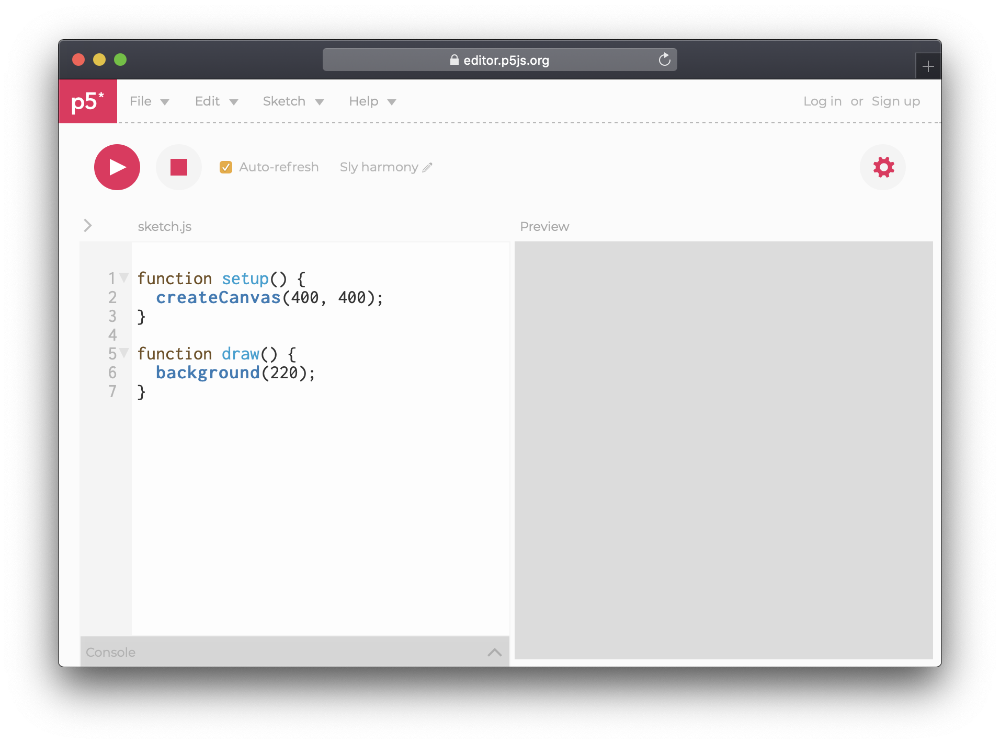

# 1. Editor

* **Sketch.js:** The name of the current file, and the place where code is written. Notice the arrow on the left of the name. By clicking it a "folder" structure is revealed. New files can be uploaded here, such as images.
* **Preview:** A preview of the code, triggered by clicking **play** or ticking **Auto-refresh**. It is possible to change the size of this window by hovering just where the code and preview meet, then click-and-drag.
* **Console**: A small window at the bottom for debugging; showing error messages or other types of information.
* **Top menu**: Many options here, but most relevant is File &gt; Save and File &gt; Share \(available only after the project has been saved\).


You can change the name of your project next to the Auto-refresh button.


