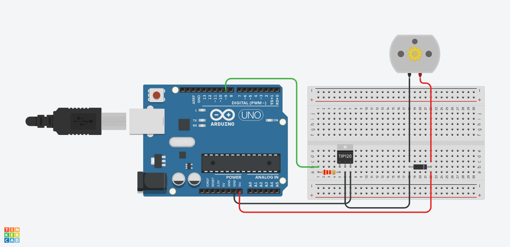

# 12V

Sensors and LEDs are low-power devices that can be powered directly from Arduino from the 5 and 3.3v pins. High-power devices such as solenoids, motors or lights require a bit more, often 12v. To control these from Arduino we use a Transistor, specifically the TIP120 Darlington Transistor.

| Parts | Quantity |
| :--- | :--- |
| Arduino Uno | 1 |
| Breadboard | 1 |
| Resistor 2.2k | 1 |
| Diode | 1 |
| TIP120 | 1 |
| Fan/Motor/Light | 1 |
| Wire Male-to-Male | 6 |



This schematic assumes that there is **external power plugged into the Arduino**. The motor in this schematic can be replaced with a light or a fan. **Note the direction also of the diode, the white strip should be on the Power end.**





```csharp
#include <Servo.h>

Servo myservo;

void setup() {
  myservo.attach(9);
}

void loop() {
  myservo.write(0);
  delay(1000);
  myservo.write(90);
  delay(1000);
  myservo.write(180);
  delay(1000);
}
```




