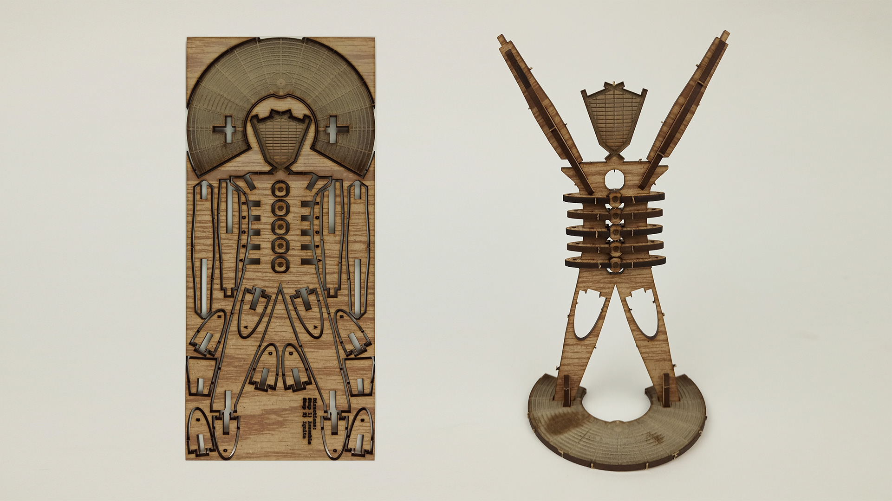

# Laser Cutting

Laser cutting is a great tool for rapidly transferring digital designs into real life objects. A laser cutter is a machine with a tube that concentrates light enough to be able to cut and engrave lots of different materials such as wood, paper and acrylic. Through a series of mirrors, this beam of light is directed down onto a work surface and controlled via X + Y axis stepper motors.

### Install

There is normally a computer connected to the laser printer running a dedicated software, such as RetinaEngrave.

### Inspiration

A simple search will show thousands of creative usages of laser cutting, since pretty much anything can be lasered and suddenly digital artists or designers can move from digital pixels to physical materials, smells, textures and measurements. It's fantastic!

When looking for more, read some articles from others as well, this one with [tips and tricks for engraving and cutting](https://www.instructables.com/id/10-Tips-and-Tricks-for-Laser-Engraving-and-Cutting/) is great, as well as this [school assignment](https://medium.com/@yyyyyyyuan/assignment-1-the-laser-cutter-wip-dc643d9be63a).


Using the machine without proper knowledge is prohibited.

1. Do not leave machine unattended when it is working \(stay close and have a look at regular intervals\).
2. Do not cut materials you do not know.
3. Do not stare at a running laser beam. It is bad for your eyes.
4. You should only be cutting materials with no coatings; no paint, lacquer or glue. If you have any doubts about the material you are trying to laser, **don’t do it**.
5. Do not laser vinyl records, that releases toxic gas that will destroy the laser tube.
6. Check lens and mirrors regularly
7. Check level of coolant and cooler temperature regularly
8. Do not run machine at 100%, think of 80% as the max
9. Clean up after you use the machine If there is something not working properly, make note of it and let others know so it can be fixed.


