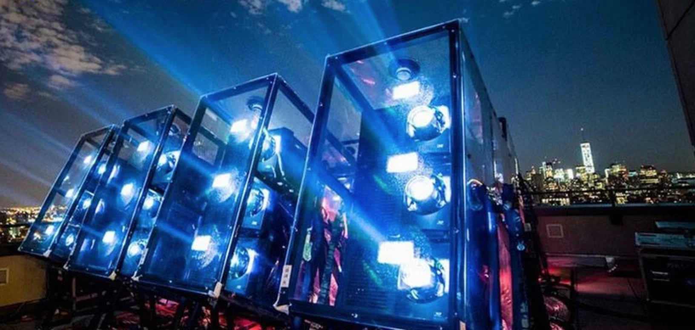

# Projectors

Projectors are an amazing piece of equipment that allows us to play with the perception of reality using light and shadows.

As a good practice you should always plan ahead and make a checklist before choosing a projector:

* What is the projection surface and surface size?
* Is the surface flat or bumpy/complex?
* Scrim material?
* Architectural projection?
* What is the environment like?
* indoor or outdoor?
* Color of the surface?
* Front or rear projection? 
* Portrait mode projection?
* Floor projection?
* Permanent projection? How many hours the projector will be ON?
* Network control?
* How much ambient light is there? Is it a bright show room, or a dim purpose-lit space? Is there lighting design?
* How to mount the projector?
* How will you run the cables from the projector to the computer? How many meters of cables will you need?
* Where is the projection Sweet Spot?
* Is there a potential people casting shadows?

![Hakana&#xEF; \[Adrien M &amp; Claire B\]](../../../.gitbook/assets/amcb-hakanai-c-romainetienne5123-w1800-h1800-1170x780.jpg)

Visiting the installation venue/space is optimal when starting to plan your installation. This will get you the best sense of space, positioning options and sense of ambient light.  Another important thing is to ask for the CAD drawings of the space.  So now it is up to you if you want to make a 3D render of the placement or even making a scale mode. 

![3D render layout from Hakana&#xEF; \[Adrien M &amp; Claire B\]](../../../.gitbook/assets/adrienm-and-claireb_hakanai-_projectorsetup.png)

