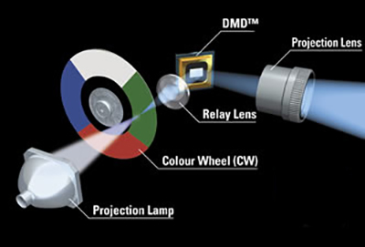
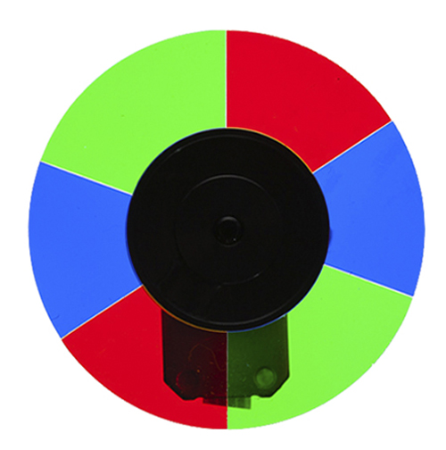
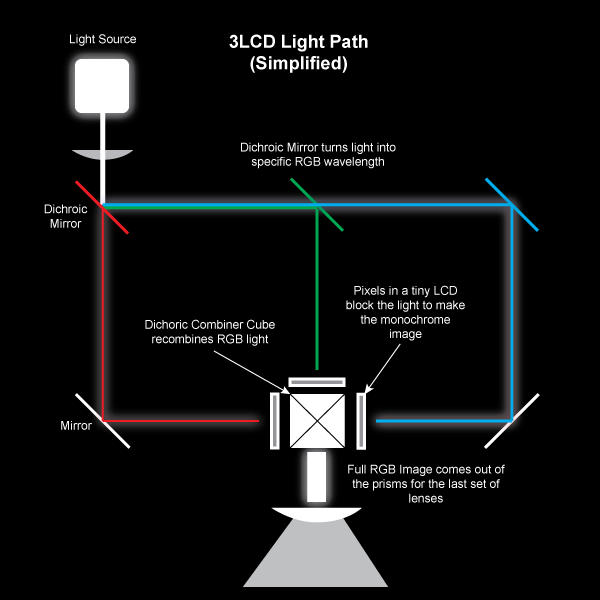
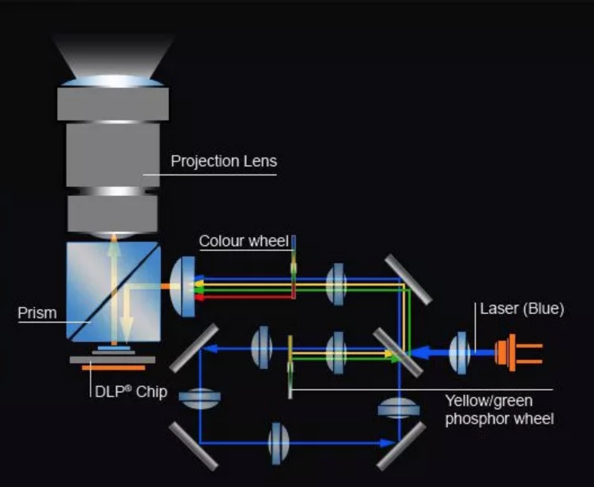

# Technology

## DLP

DLP stands for _Digital Light Processing_. This is one of the most commonly used projector types. One of the key features of a  DLP technology is that it can display much darker blacks than LCD technology which is especially helpful for illusions like projection mapping. 

Within DLP projectors you can find two types, Single chip and 3-Chip. In single chip DLP,  a light source is passed through a rapidly spinning multi-segment color wheel of 3 or more dichroic glass sections \(7 or more color segments is a more "desirable" spec than 3\). That light then bounces off a matrix of electrically controlled microscopic mirrors that determine the brightness of each individual pixel. The beam then passes through filters and out through a lens. The timing between the color wheel and the movement of the mirrors determines the color of the output.

Standard DLP projectors use 3-segment color wheels. 4-part color wheels add a white segment \(to increase brightness\). 6-segment color wheels deliver a wider color range. [6x Speed RGBRGB Color Wheel projectors](https://www.viewsonic.com/us/px725hd.html) boost red, blue, and green hue and saturation. The result: vivid images with smoother color gradients. 

Here is more information about it: [https://forums.afterdawn.com/threads/the-3-types-of-projector-explained-lcd-dlp-crt.291323/](https://forums.afterdawn.com/threads/the-3-types-of-projector-explained-lcd-dlp-crt.291323/)

## LCD

There are a couple different LCD technologies for projection, but 3LCD is probably the most recommended in terms of image quality. With LCD projection, a light source is bounced through 3 dichroic filters that turn the white light into precise red/green/blue frequencies. Those differently colored beams of light then pass through liquid crystal arrays that turn on and off their pixels and block the different light patterns to form the image. Those LCD's are then recombined with a prism that recombines the 3 colored segments into a single light beam/image that then passes through a lens. 

LCD projection doesn't have the rainbow banding effect that DLP does and tends to be easier to film, but it doesn't have the darkest blacks, so it doesn't disappear as much when the screen is just displaying a black image, and you can see more like a grayish color.

## Laser

What can I say about Laser projectors, well they are the " new thing" and they are super cool, and set to become the standard for projector technology.  According to Futuresource, the market for projectors in 2020 will be 74% laser based. It offers reliability, high brightness, and is set to offer significant advantages to a range of industries or applications including cinema, large venues, education and control room. 

#### Laser offer  new benefits and here is a few of them:

* Illumination source lifetimes of 20,000 hours or even more
* More brightness – up to 70,000 lumen
* Lower brightness decline during life time
* Better brightness uniformity
* Generally maintenance free, as no lamp replacement necessary
* Higher reliability
* Higher contrast
* Wider color gamut
* Lower energy consumption and lower thermal emission
* Instant on/off capability, flexible brightness adjustment \(20-100%\)
* Mercury free

There are numerous benefits with a laser light source, but the bottom line is that they more closely address the needs of the market and laser is being adopted in growing numbers. 

The qualitative brightness superiority and potential for energy savings combined with the significant reduction of maintenance cost makes it likely that laser will eventually replace lamp-based projection systems as the primary projection light source.


**There is a myth out there about Laser projectors can only be installed by specialists. This might have been true previously, as laser regulation meant that the installation process had to be conducted by a trained professional. Now, however, the installation of laser projectors has been made easier, as classification changes mean that specially trained laser officers are not required – previously this would have added complexity to the installation. Now, there are recommendations for health and safety but is it no longer in the realm of laser regulation. For early adopters of laser, this transforms the installation process, making it easier, more cost-effective and faster.**


