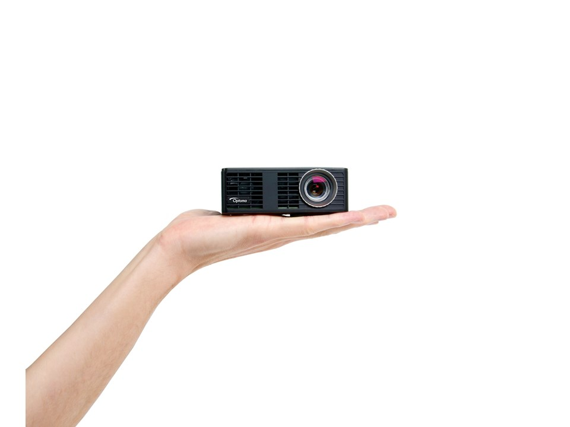
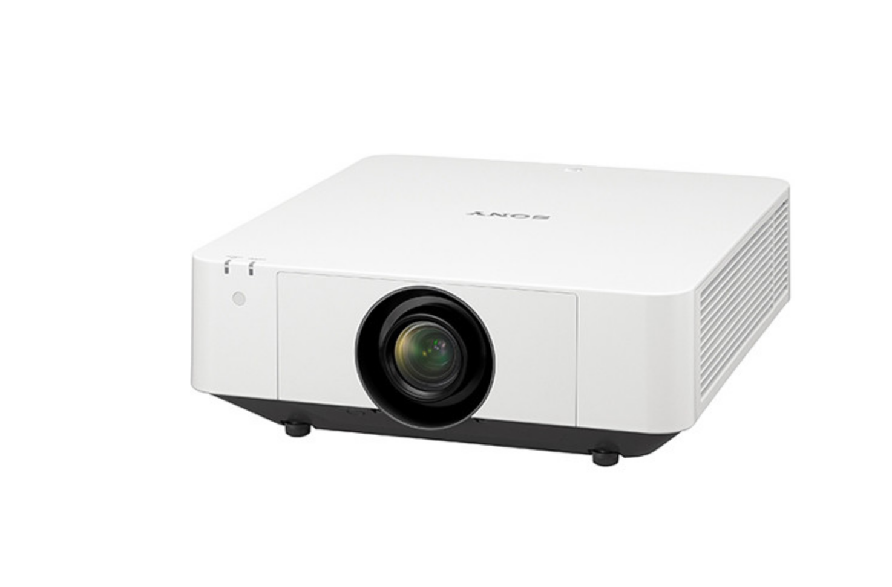
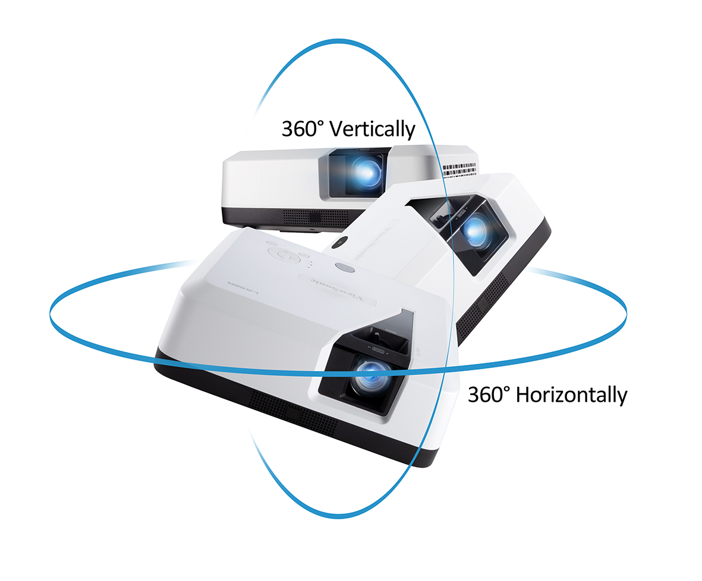
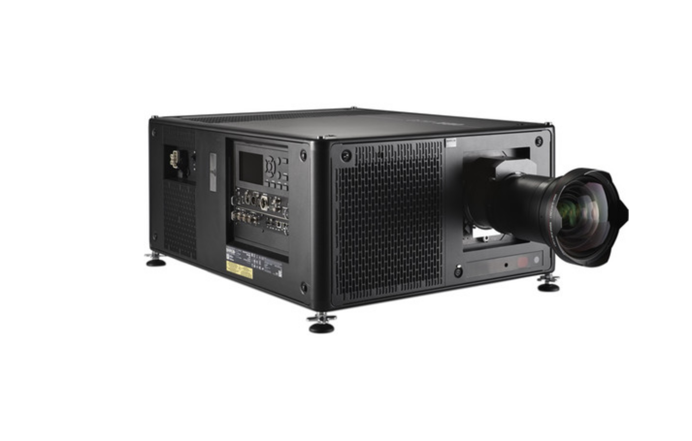

# Types

Each project might need a different type of projector, maybe you are doing a projection in dark and control room in an art gallery or an interactive projection and you can’t have the shadows of the audience, or could be a massive projection and you need 20 large venue projectors. 

When you are planning your project is very important to understand what type of projector you need and why.

## Pico Projectors

I’m not going to talk so much about this one, because probably you will not find so many situation where you need this type of projector.  Normally the **Brightness range :** 20 lumens to 1000 lumens, and a **Resolution range :** 640 x 360 to 1280 x 800

Some pico projectors can be powered with batteries, and just few has infinite depth of field and require no focusing, so you can project on very close up things clearly.

But if you want to get inspired with what you can do with a pico projector and be creative here is a nice example: [https://www.youtube.com/watch?v=cwL3PEeE0sU](https://www.youtube.com/watch?v=cwL3PEeE0sU)

## Portable Projector

This type probably you are very familiar with, they are very common in classrooms and small office space. Normally they only have a single lamp, not so bright and the mechanical parts inside are not so stable, so don’t crazy with this type of projector.

**Brightness range:** 1000 lumens to 3000 lumens **Resolution :** 1024x768 to 1080 p

For sure you can use these ones in an installation, but be aware they aren't designed for that, most of the times can be very difficult to setting them up in an installation. Some projectors just don't handle 24/7 operation very well, so keep this in mind. 

With portable projectors you will encounter multiple limitations: 

* Limited options for throw ratio 
* Image sizes
*  Brightness range
* Very limited zoom adjustments
* No lens shift

If you want to use this type in an outdoor installation just take in consideration that it has to be pitch black and not so big screen size.

## Installation Projectors

So probably over 85% of your projects will be **OK** using this type of projector, and media artists loves these ones.

**Price Range:** $2200 - $13,000 **Brightness range**: 3000-10000 lumens **Resolution range**: 1280x720 to 1920 x1200

It's hard to cover  as there are a wide range of brands, lenses, and imaging elements. 

They will cover you in most indoor installations if you're trying to cover a reasonable amount of space \(ambient light and windows permitting\). These ones tend to be heavier and larger \(6 kg+\) but offer more configuration options than the portable class \(control over LAN and HDBaseT\). They are also designed for 24/7 operation so they are more acceptable to use for long term installations. Some models also support portrait mode projection and 360º rotation. Maintenance and support is generally easier with these as well, but at an obvious jump in price.

These projectors also start to bring in multiple lens options for short throw 0.4 to long throw 4.0 ratio with the same body. They also offer more options for lens zoom and lens shift which are super handy.

If you're trying to get more than a 6 meters wide image or are dealing with stage lighting,  you will need to do some brightness and size calculation before you commit to these ones, but we will talk about that later. 

If you are planning to have an installation longer than a week probably will make more sense if you buy one one of these instead of renting, it quickly becomes more cost effective to just purchase one of these classes of projectors \(or the portables\) because you would be paying the same amount in a week or so anyway.

## Large venue projectors

Most of the time if you ever need a large venue projector probably you are hiring a company that does all the calculations for you,  nevertheless still a good a idea to have a solid understanding on how to work with this type of projectors. 

**Price Range**: $8000 - More than a house       **Brightness Range**: 5000 lumens to 75,000 lumens \( as far as I know\)  **Resolution Range**: 1920x1080 to 4K

These ones are commonly used for large scale projection mapping, big venue concerts or the theater. 

The high powered bulbs in these ones are also much more of a safety issue. When choosing a 15k versus a 30k rental for an event, I highly trained technical staff often has to be on-site to handle the operation of the projector, some venues and countries need the fire marshall to approve the use of it because of the potential of a fire hazard . The power of the bulbs also significantly shortens their lifespan down to about 1000 hours of operation compared to the smaller ones. The aging of these bulbs also has a much more noticeable effect on the image. Older bulbs will look much dimmer and more off color than brand new bulbs - something to keep in mind if you're working with multiple high power projectors is to keep an eye on bulb life.

Placement and mounting of these projectors is another important consideration. Some of the larger ones weigh 100+ kg and will require trussing and investigation about whether the ceiling or structure can actually support them. For some events you may end up constructing a scaffold tower with the huge projector on top, and with your power supplies, media servers and workspaces underneath.

Like installation projectors, large venue projectors often offer multiple lens options for the same projector. Most offer throw ratios from 0.8 to about 7.0 or 12.0. These super zoomed ratios are helpful if you have a really tall building to projection map from the ground, or a screen that is over 30 meters away and you're trying to conserve your precious photons. 

