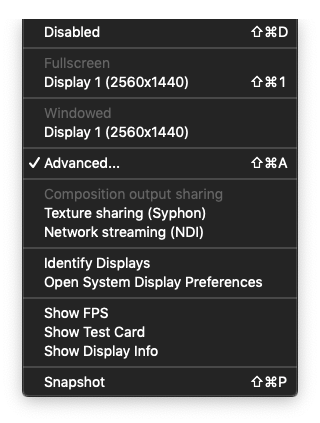
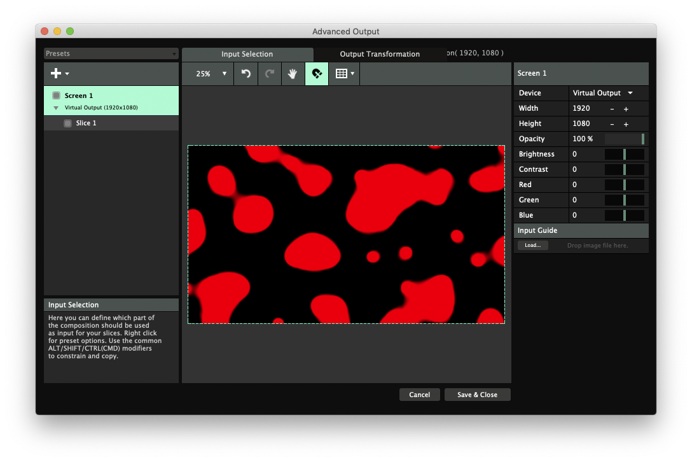

# Projection mapping

Beyond the **x and y** of screens and walls **we find z**, the axis we use to measure depth. Due to depth we move away from pixels, and enter physicality, through light and shadow. _It is possible to map visuals on a flat surface, but it really shines when applied with a sense of depth in mind._

In the top menu, click **Output** and **Advanced.**

There are many other settings here, all insignificant at this stage, but to return to "normal" output choose either **Disabled** or any of the displays under **Fullscreen** or **Window.**

Click the **large plus + sign** in the top left and a menu pops up. The relevant options are **Slice, Polygon, Output Mask.**

