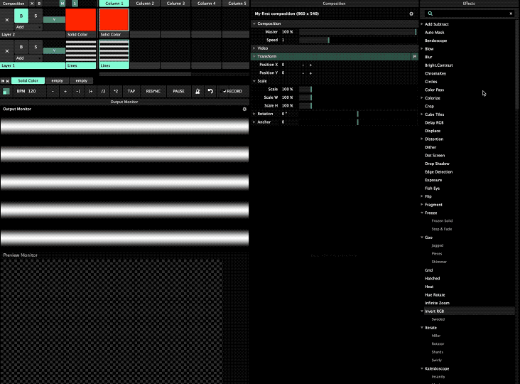

# Effects

Ah, the wondrous world of visual effects,  attractive at first, but likely to fade over time. I mean, there's only so much the Kaleidoscope effect can do for you. However, experimentation goes far, and stacking effects can yield unexpected and fantastic results.

Simply drag and drop the effects to either the **Clip**, **Layer** or **Composition**. If possible, choose the latter, as it provides some sense of overview. The order which the effects are presented is important as they trickle down. It is also possible to block \(**B**\) or remove an effect with the X.

Effects come in a wide range but can generally be categorised under **Editing** and **Visual FX**. 

Hungry for more? [The Juice Bar](https://get-juicebar.com/) has a shop of effects and sources. Quite pricey, but could be worth it!

