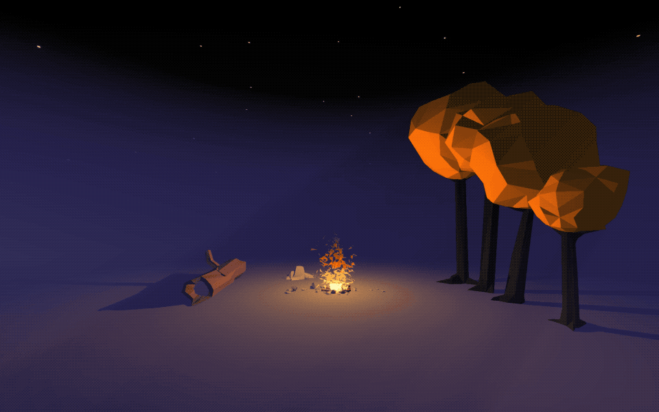

# Mixed Reality \(A-Frame\)

[A-Frame](https://aframe.io/) is a web framework built on [Three.js](https://threejs.org) for building mixed reality experiences. It is made possible thanks to the Web Graphics Library \(WebGL\).

### Install

A-Frame runs in the browser and is included as a JavaScript library in an HTML document. Use an online editor such as [Glitch](../../guides/glitch.md) \(choose New Project and Hello Webpage\) or create an index.html file locally using [Visual Studio Code](https://code.visualstudio.com/) or [Sublime Text](https://www.sublimetext.com/).

Visit [Campfire VR](https://curious-electric.com/w/experiments/aframe/campfirevr/) \([article](https://medium.com/@dirkk/campfire-vr-fa654d15e92a)\) for an example of what can be made.



### Model Viewer

3D, VR and AR have browser native tags available. Consider these when simply wanting to present a 3d object with only camera interaction.

```markup
<model-viewer
  src="https://modelviewer.dev/shared-assets/models/Astronaut.glb"
  ar
  ar-modes="webxr scene-viewer quick-look fallback"
  ar-scale="auto"
  camera-controls
  skybox-image="https://modelviewer.dev/shared-assets/environments/aircraft_workshop_01_1k.hdr"
  ios-src="https://modelviewer.dev/shared-assets/models/Astronaut.usdz"
></model-viewer>

```

