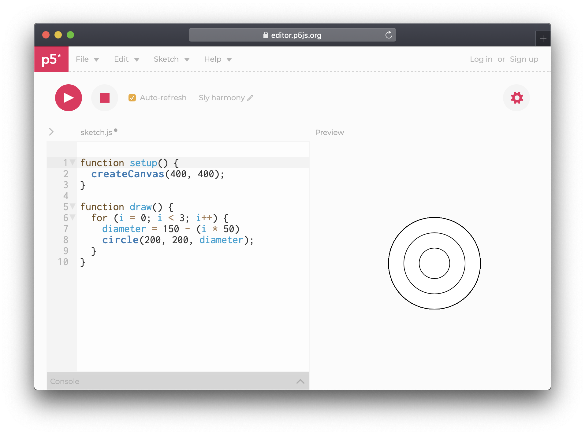

# 11. Loops


When you want to create three circles, each a bit smaller than the previous one, you could do this:

```javascript
circle(200,200,150);
circle(200,200,100);
circle(200,200,50);
```

But you could also do this:

```javascript
for (i = 0; i < 3; i++) {
  diameter = 150 - (i * 50)
  circle(200, 200, diameter);
}
```

As long as the statement is true, whatever is inside the curly brackets will happen. It begins with defining a variable, in this case "i" with the value of 0. And then continues by saying that “as long as x is less than 3, increment i with 1. This will happen until i reaches 2, after which it will exit the for loop.




Be mindful of Auto-refresh while working with loops as the sketch can get stuck in an infinite cycle, which will crash the browser or cause it to freeze.


