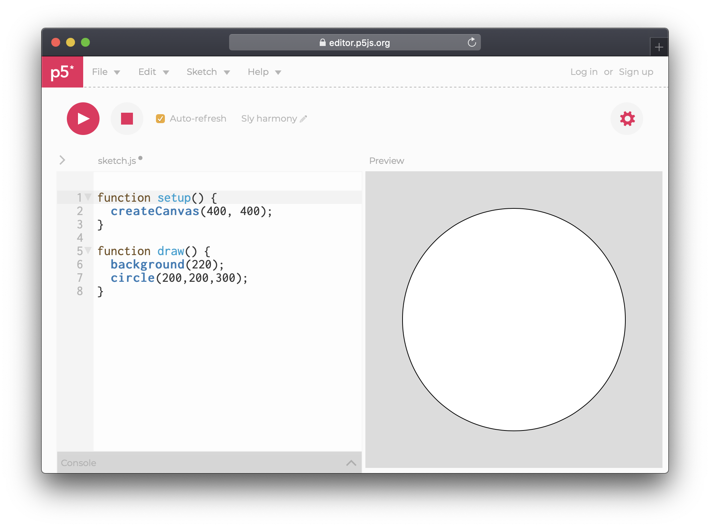

# Shapes

Rectangles, ellipsis, lines, polygons — it is possible to draw all kinds of shapes \(even 3d\) but let us begin by drawing a circle using the `circle(x, y, diameter)`.

```javascript
circle(200, 200, 300);
```

The first two values tell the circle where to be positioned, while the third  defines the size. With the default canvas size of 400 pixels, the circle will be placed in the middle, since the circle point of origin is its centre.



Besides circles we can also add a `square(x, y, size)`. After the circle, make a new line by pressing Enter, then type…

```javascript
square(200, 200, 200);
square(0, 0, 200);
```

The values for the square are similar to that of the circle, however, squares have their point of origin in their top left corner, which is why they are not placed in the middle of the canvas.


