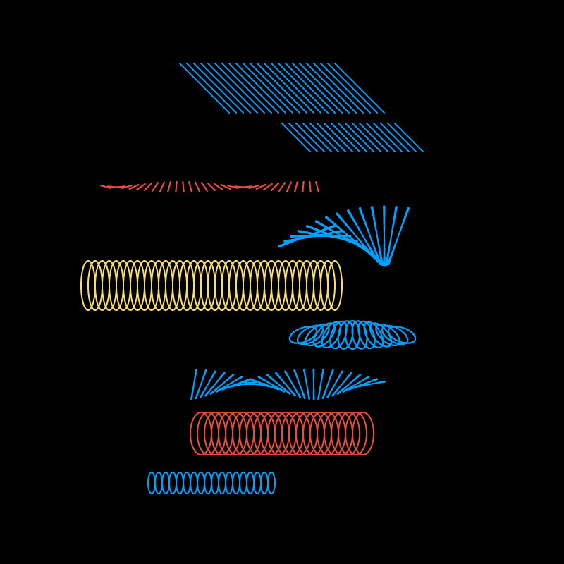

# 🌼 Type

Create a letter \(choose from EXPLORING CODE\) using **previous steps** in combination with **lines and curves**, **animation** and **randomness**.

Your canvas should be **square** and your letter **centred**.



