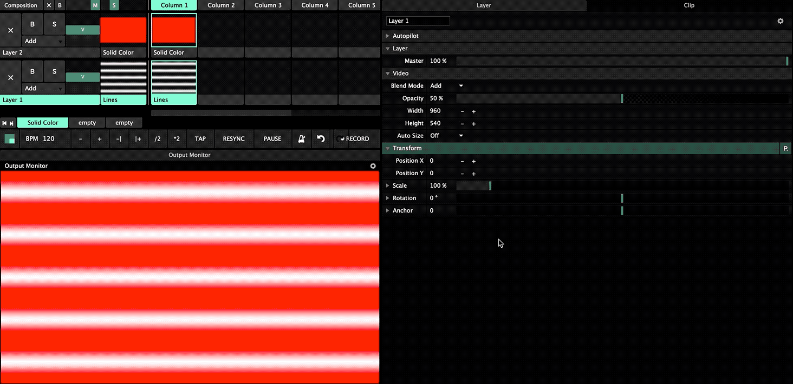

# Parameters

Whether it is the **Composition**, **Layer** or **Clip**, each come with a set of parameters that can be adjusted. Be mindful that there is a relationship between all three:

* Changes to a clip affects only the clip. 
* Changes to a layer affects all clips on that layer.
* Changes to the composition affects all layers.

Knowing that, let's check out the common parameter **Transform**. Expand it to find **Position**, **Scale**, **Rotation** and **Anchor**.  Click the arrow next to the parameter to get finer control.

Only certain clips come with unique properties, such as the **Lines** and **Color** generator. Click the **Lines** clip and change some of its values.


Right-click on a parameters to have it reset to its default value!



Avoid doing too many \(or any\) changes to a clip transform as it can become confusing in combination with layer transform. This depends solely on the situation, but if possible, group clips in such a way that adjustments to the layer is sufficient.


