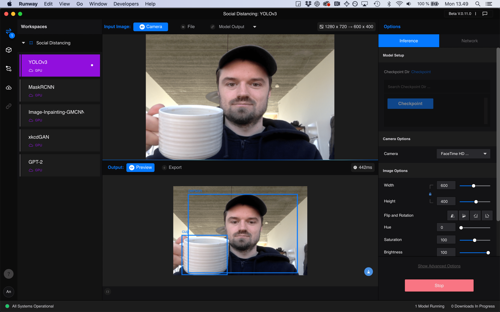

# Runway

Runway is a commercial desktop software, that makes it easy to explore advanced machine learning models and running them remotely on Runways servers.

 

* **Browse**

  Discover new machine learning models in RunwayML's Model Directory.

* **Train**

  Train your own machine learning models with a few clicks.

* **Experiment**

  Quickly play with machine learning models. No coding required.

* **Integrate**

  Connect your RunwayML models to other applications.   

## Links

[Download Runway and set up an account](https://runwayml.com/)

[Runway github with repos for integrating with Processing, TouchDesigner, p5js, etc](https://github.com/runwayml) 

