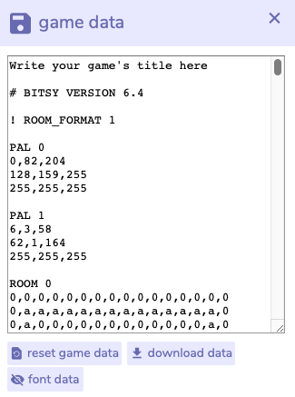

# Save & Export

To export your game so others can play it, go to the **download** window in the tools. This will export your game as an HTML file. You can upload this to a website or just click on it on the desktop to have in launch in a browser.


You can also load a Bitsy game from a previously exported HTML file!


If you want to keep working on your game, you will need to open the **game data** window and choose **download data**. this is the text data that represents logic, pixel art, and text of your game.


Your game is saved within the browser. If you clear your browser cache, the game is lost. Always download the game data to be sure progress is maintained.


