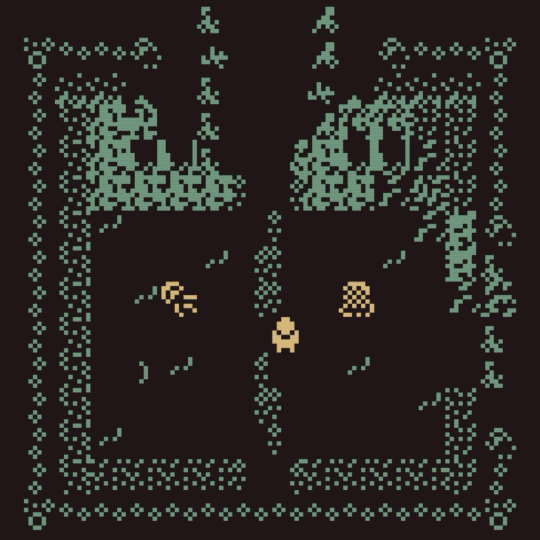

# Inspiration

Bitsy, just like Twine, is nurturing creatives around the world, and spreading the joy of games, and game-driven stories. Follow [Bitsy Pieces](https://twitter.com/bitsypcs) to see what is happening within the community around the world, and join [Bitsy Talk](https://discordapp.com/invite/9rAjhtr), the Bitsy discord channel.

## [The Spriters Resource](https://www.spriters-resource.com/)

It is quite fortunate designing pixel games as so much has already been made, so there's lots of great inspiration out there. TSR rips the sprite sheets from games, so that others may understand better the graphic design within classic games like Final Fantasy or Super Mario.

