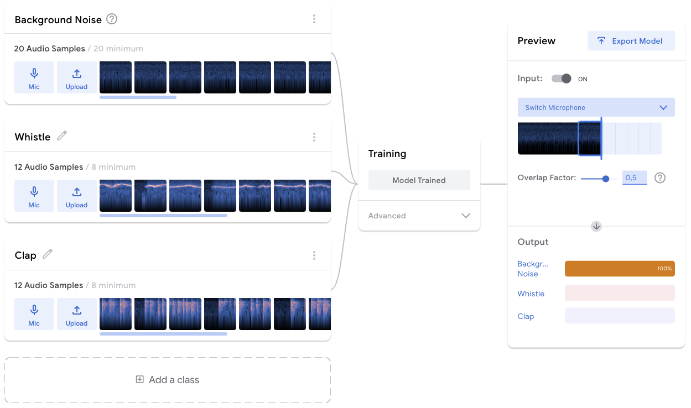
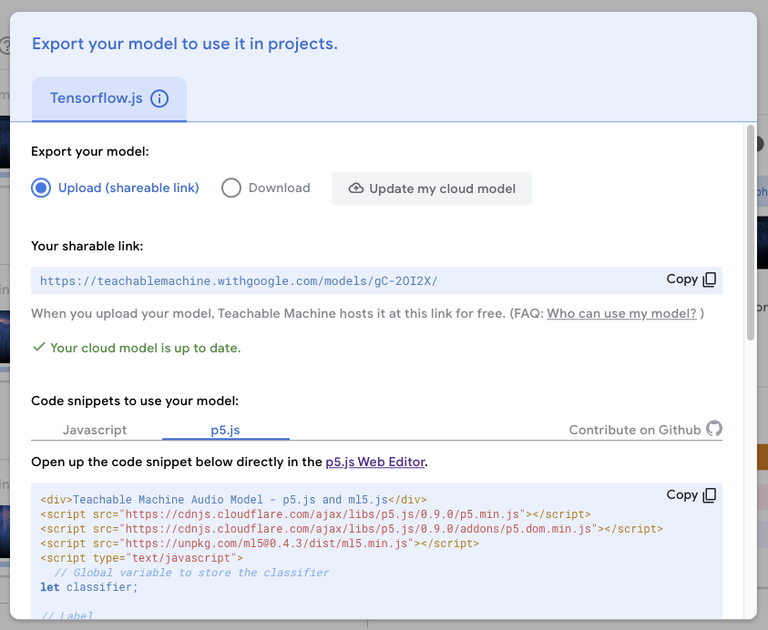

# Teachable Machine

It is possible to create custom training models using [Teachable Machine](https://teachablemachine.withgoogle.com/)!

## Choose Project

There are three types of training projects: Image, Audio and Pose. Choose the one appropriate for the project. This example will use **Audio Project**.

### Train

1. Record Background Noise by choosing Mic, Record 20 seconds and Extract Sample.
2. Record Class 2 in the same manner, make it distinct.
3. Add a class, and train it with a different sound.
4. Keep adding classes until the training set is "complete". Remember to name the classes to something relevant.
5. **Train Model**


Start recording as the input is already happening, for instance, whistle before pressing record, and end the recording before you stop.


Once trained, a Preview appears. Validate the inputs by finding the class label and seeing if it increases as the input is made. Re-train the model if needed. Then **Export Model**.



### Export

1. Choose **Upload my model** to upload the model. This will make it usable by others, and easier to share. It is also possible to download, and import in your project.
2. Once uploaded a **shareable link** will appear, that means the upload was successful!



## Whistle and Clap

This example uses the model trained above. Change the `soundModel` to your link for your input.



```markup
<html>
  <head>
    <script src="https://cdnjs.cloudflare.com/ajax/libs/p5.js/0.9.0/p5.min.js"></script>
    <script src="https://cdnjs.cloudflare.com/ajax/libs/p5.js/0.9.0/addons/p5.dom.min.js"></script>
    <script src="https://unpkg.com/ml5@0.4.3/dist/ml5.min.js"></script>
  </head>
  <body>
    <script>
      let classifier;
      let timer;
      let label = "listening...";
      let options = {
        probabilityThreshold: 0.7
      };
      let soundModel =
        "https://teachablemachine.withgoogle.com/models/gC-2OI2X/";

      function preload() {
        classifier = ml5.soundClassifier(soundModel + "model.json", options);
      }

      function setup() {
        createCanvas(320, 240);
        // The sound model will continuously listen to the microphone
        classifier.classify(gotResult);
      }

      function draw() {
        background(0);
        // Draw the label in the canvas
        fill(255);
        textSize(32);
        textAlign(CENTER, CENTER);
        text(label, width / 2, height / 2);
      }

      // The model recognizing a sound will trigger this event
      function gotResult(error, results) {
        if (error) {
          console.error(error);
          return;
        }
        // The results are in an array ordered by confidence.
        // console.log(results[0]);
        label = results[0].label;
        timer = setTimeout(function() {
          label = "";
        }, 500);
      }
    </script>
  </body>
</html>
```



