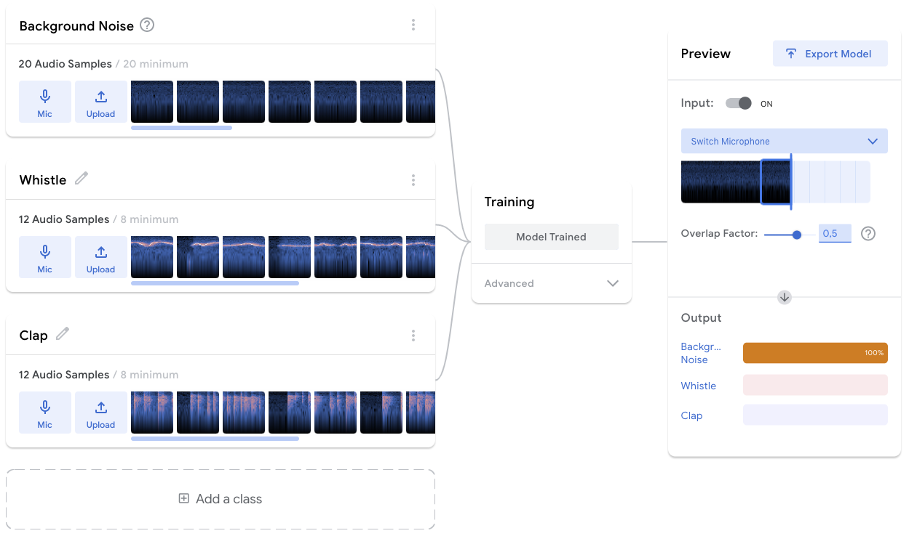
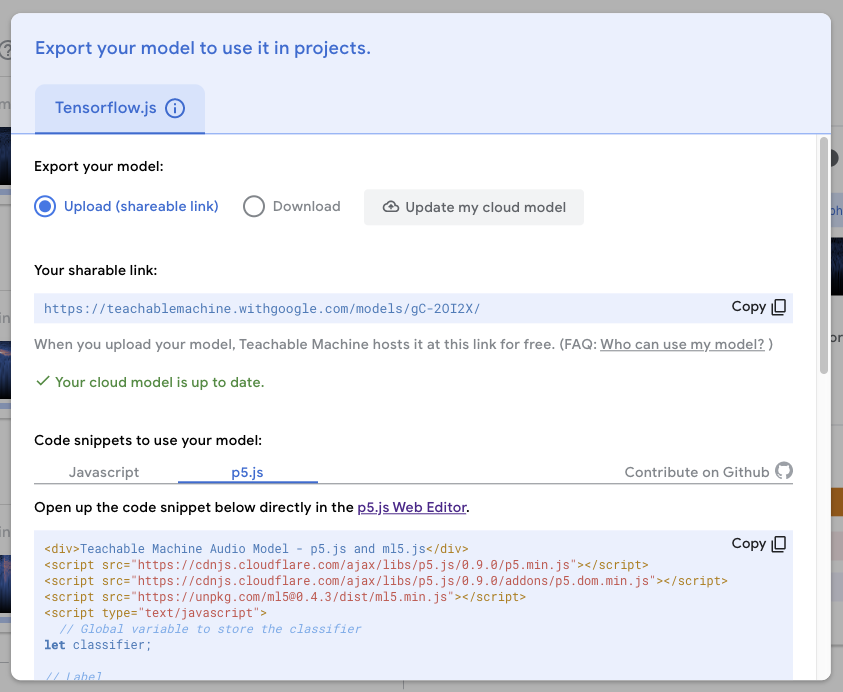

# Teachable Machine

It is possible to create custom training models using [Teachable Machine](https://teachablemachine.withgoogle.com/)! 

As you get started, there are three types of training projects: Image, Audio and Pose. Choose the one appropriate for the project. This example will use **Audio** but they all share a similar process:

1. Record Background Noise by choosing Mic, Record 20 seconds and Extract Sample.
2. Record Class 2 in the same manner, make it distinct.
3. Add a class, and train it with a different sound.
4. Keep adding classes until the training set is "complete". Remember to name the classes something relevant.
5. **Train Model!**


Start recording as the input is already happening, for instance, whistle before pressing record, and end the recording before you stop.


Once trained, validate the inputs by finding the class label and seeing if it increases as the input is made. Re-train the model if needed. Then **Export Model**.

1. Choose **Upload my model** to make it easy to use for others and yourself. It is also possible to download, and import in your project.
2. Once uploaded a **shareable link** will appear, that means the upload was successful!
3. Use the link and replace the ones in the [Examples]()!

