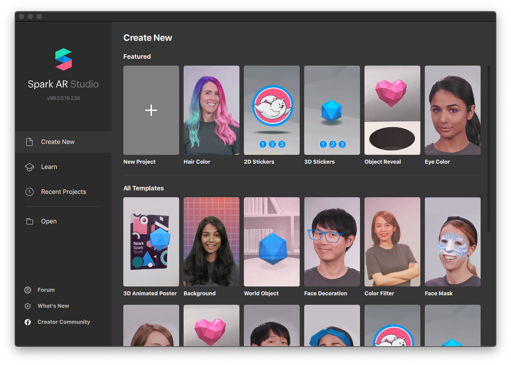

# Spark

Build augmented reality experiences for Instagram \(and Facebook\) using Spark AR Studio.

### Install

Get [Spark AR Studio](https://sparkar.facebook.com/ar-studio/) on desktop and the [Spark AR Player](https://apps.apple.com/us/app/spark-ar-player/id1231451896) on your mobile device. Once installed, open it up and browse around a bit, the **Learn** section is a great place to start. When ready, click **Create New** and choose **New Project** \(or pick an interesting template\).


In order to use Spark you also require a Facebook account!


## Getting started

