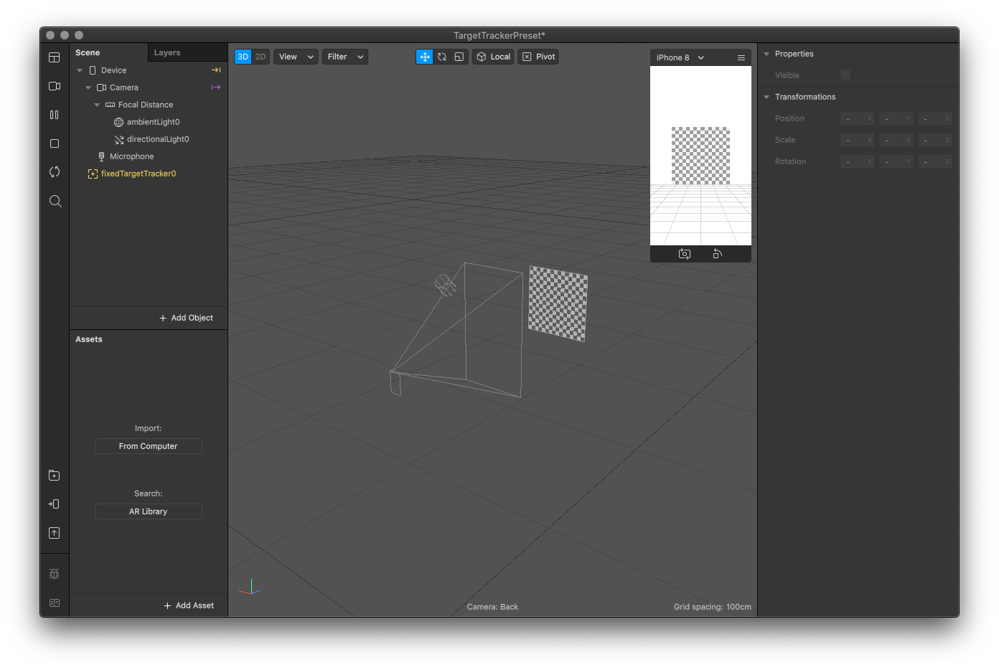

# Target Tracking

Perhaps the most interesting feature are the target and plane tracking abilities. For some reason, most of the AR community is fascinated with playing around with the face.

Create a **New Project** and choose **Target Tracking**. A template should open with some preset assets, we'll get to those in a minute.

Before we update the target tracker, download this image.

Now, select **fixedTargetTracker0** and in the far right menu, click **Choose File…** next to **Texture**. Select the recently downloaded image.

* ​[https://sparkar.facebook.com/ar-studio/learn/documentation/tracking-people-and-places/target-best-practice/](https://sparkar.facebook.com/ar-studio/learn/documentation/tracking-people-and-places/target-best-practice/)​
* ​[https://sparkar.facebook.com/ar-studio/learn/documentation/tracking-people-and-places/effects-in-surroundings/creating-a-target-ar-effect/](https://sparkar.facebook.com/ar-studio/learn/documentation/tracking-people-and-places/effects-in-surroundings/creating-a-target-ar-effect/)​

