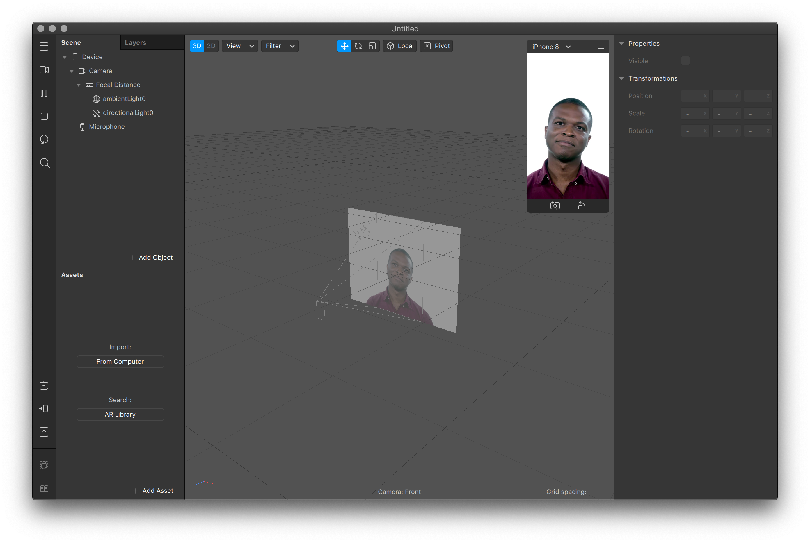

# 1. Editor

Before we get building, let's get acquainted with the editor. Create a **New Project** and choose **Blank Project**.

The editor is straightforward. There's the **Scene** in the top left, and the **Assets** in the bottom left. In the far left there's a menu that reads:

* Workspace
* Video
* Play/Pause
* Stop
* Restart
* Search
* Library
* Test on device
* Upload and Export
* Report
* Documentation

Here's a few basic steps to get you going.

### Remove default video

Click **Video** and select the blank option under **Real-Time Simulation**. Notice that it is possible to upload your own video, and initiate any connected cameras.

### 

