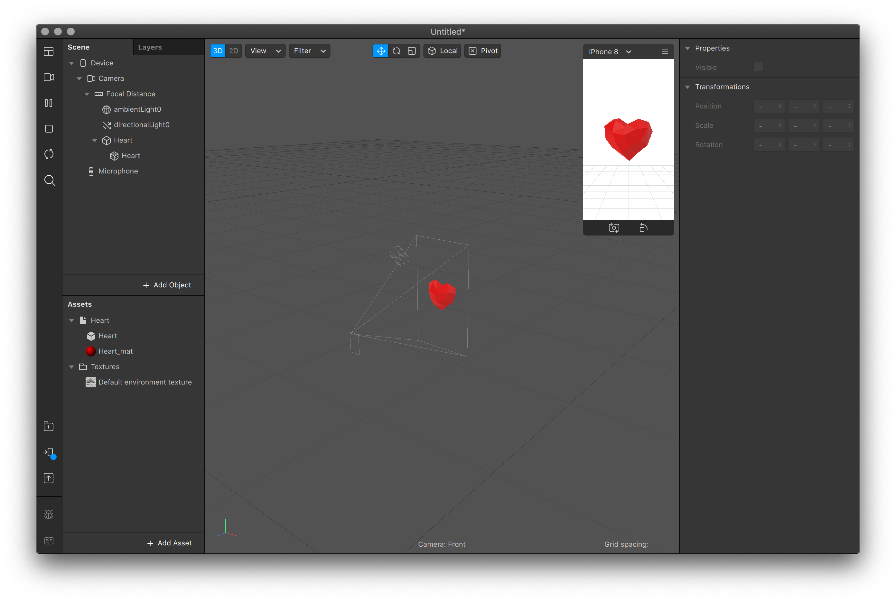

# 2. Heart

Click **Library** and select **3D Shapes**. Scroll down and click the Heart Primitive and select **Import Free**. The window does not automatically close, so close the window…

Finally, **Assets** is not empty anymore. Grab the Heart, and drag it into the **Viewport** \(the large grey space in the middle\). It should appear under **Scene** and become visible.

### Color

The heart is lacking color, so let's give it some. Unfold the Heart object by clicking the small arrow in **Assets**. Then, select the **Heart\_mat** and a menu will open on the far right. Select **Color** under **Albedo** and change it to your favourite color!

### Transformations

It's also a bit too small… Let's change that. Click the Heart object in **Scene** and change the **Scale** to reflect the size you feel is appropriate, in all axis.

