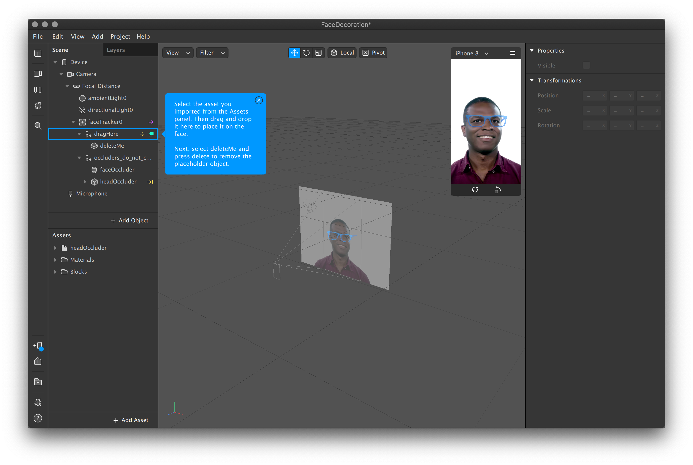

# Face Decoration

A **Face Decoration** is a **Face Tracker** combined with a **3D assets**. Use the template Face Decoration \(Head and Neck are also good places to start\) project and add your own assets or File &gt; Import from AR Library…


Remember to reduce size of 3d assets as there is a max size of 4mb allowed for Instagram filters


