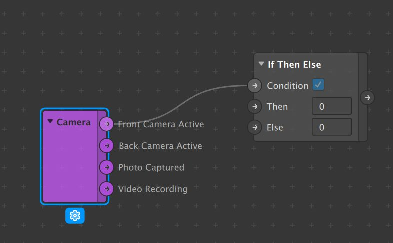

# Scripting

## Materials

Materials in Spark can have different shader types:

1. Flat
2. Standard
3. Physically-Based
4. Face Paint
5. Blended
6. Retouching

Each type comes with its own set of parameters and therefore also script references \([link](https://sparkar.facebook.com/ar-studio/learn/documentation/reference/classes/shadersmodule)\). To update the shader we update its input texture.

```javascript
  var r = Math.random();
  var g = Math.random();
  var b = Math.random();

  var col = R.pack4(r, g, b, 0.5);
  const textureSlot = S.DefaultMaterialTextures.DIFFUSE;

  object.material.setTexture(col, { textureSlotName: textureSlot });
```

## Animation

```javascript
const A = require("Animation");

let baseDriver = A.timeDriver({
    durationMilliseconds: 1000,
    loopCount: 1, // Infinity
    mirror: false
  });
  
  baseDriver.start();
  A.samplers.easeOutQuint(0, 1); // from, to
  
  let val = A.animate(baseDriver, baseSampler);
  
  object.transform.scaleX = val;
  object.transform.scaleY = val;
  object.transform.scaleZ = val;
  object.material.opacity = val;

  baseDriver.onCompleted().subscribe(function() {
      Diagnostics.log("Animation completed!");
  });
```

## Debugging

[https://sparkar.facebook.com/ar-studio/learn/documentation/docs/testing-debugging/](https://sparkar.facebook.com/ar-studio/learn/documentation/docs/testing-debugging/)

```javascript
// Load in the Diagnostics module
const Diagnostics = require('Diagnostics');

// Log a string message  
Diagnostics.log('A console message logged from the script');

let myVariable = 5;

// Log a variable's value  
Diagnostics.log(myVariable);
```

Signal values can be shown in the **Console** from within a script with the `watch()` method of the Diagnostics Module.

```javascript
// Load in the required modules
const Diagnostics = require('Diagnostics');
const FaceTracking = require('FaceTracking');

// Add the mouth openness signal to the watch view
Diagnostics.watch("Mouth Openness - ", FaceTracking.face(0).mouth.openness);
```

When the console is not available, for instance when testing out on a device, go to Add &gt; 2D Objects &gt; 2D Text. Place the text object and then update its text value in code whenever information needs to be visible.

```javascript
const text = Scene.root.find('2dText0');
text.text = myString;
```

## Found <a id="found"></a>

```javascript
const P = require("Patches");var trackerFound = P.getBooleanValue("trackerFound");​trackerFound.monitor().subscribe(function(e) {  Diagnostics.log(e.newValue);});
```

​

* ​[https://sparkar.facebook.com/ar-studio/learn/documentation/reference/classes/patchesmodule/](https://sparkar.facebook.com/ar-studio/learn/documentation/reference/classes/patchesmodule/)​
* ​[https://sparkar.facebook.com/ar-studio/learn/documentation/reference/classes/scenemodule.targettracker/](https://sparkar.facebook.com/ar-studio/learn/documentation/reference/classes/scenemodule.targettracker/)​
* ​[https://sparkar.facebook.com/ar-studio/learn/documentation/reference/classes/Rmodule.boolsignal/](https://sparkar.facebook.com/ar-studio/learn/documentation/reference/classes/Rmodule.boolsignal/)​

## [Camera](https://www.facebook.com/groups/289750598103656?view=permalink&id=826827894395921&comment_id=934684263610283&notif_t=group_comment&notif_id=1594802062459654&ref=m_notif)

```javascript
const CameraInfo = require('CameraInfo');
const D = require('Diagnostics');
CameraInfo.captureDevicePosition.monitor().subscribe( function(e) {
D.log(e.newValue);
//Your IF statement can go here.
//if(e.newValue == "BACK") ... etc
});

//The real trick with reactive is to setup a monitor subscription, which will send a signal anytime that value changes - which means you can put code inside that monitor and fire it anytime the value changes (or if the value is something specific, like BACK)
//Diagnostic logging is pretty key to scripting in Spark. If you log the camera module itself, it will explain how to use it:
const CameraInfo = require('CameraInfo');
const D = require('Diagnostics');
D.log(CameraInfo);
//Take those options, throw a monitor on them, run the code you need!
```




