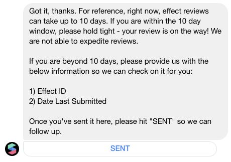

# Upload Effect

Ready to upload? Great! There are a few different scenarios for uploading an effect to Instagram.

1. Upload through Spark. Click **Upload** in the bottom left. It will by default upload an effect titled "Untitled".
2. Export the effect and upload manually to [Spark AR Hub](https://www.facebook.com/sparkarhub/). In Spark, click **Upload** in the bottom left. The file can be max **4mb** for Instagram and **10mb** for Facebook. Upload through Spark AR.

To upload an effect to an Instagram account, your [Facebook account must be attached to the Instagram handle](https://help.instagram.com/176235449218188). If there is an account already attached, your personal account must be made an admin/editor of that account.


Remember to read the [Review Policies](https://sparkar.facebook.com/ar-studio/learn/publishing/spark-ar-review-policies)!


### My effect did not pass review

Don't fret, it's not the end of the world. Unless you believe a specific change will make it pass then there are two ways forward:

1. Click Test on device with a device connected running Spark AR Player and unplug the cable. The effect is still running on the device! Just do not turn off the application.
2. When up for review, a temporary test link will be shared covering up to 50 unique users. The URL is not very friendly but can be easily attached to a QR code.

### My effect is under review forever

The review process for uploading an effect can be anything from a few hours to 10 days, so plan accordingly. It is possible to reach out to the [Spark AR Creators](https://www.facebook.com/SparkARcreators/) page if more than 10 days have passed since the latest submission.

