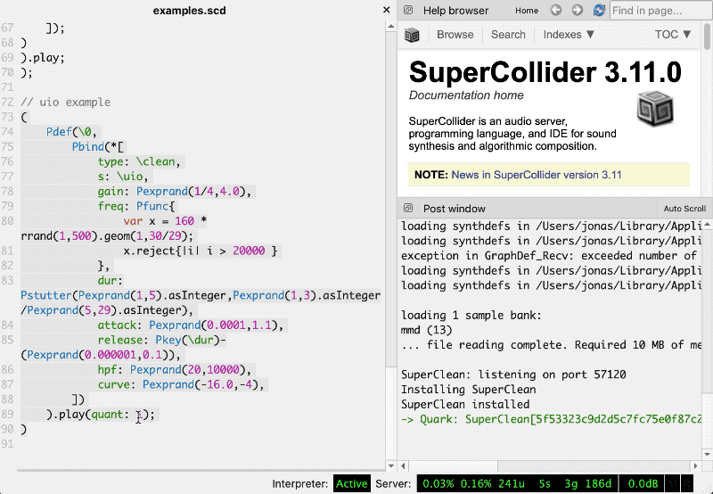

# SuperCollider


Written by [Daniel M Karlsson](http://danielmkarlsson.com/)


### Install

Download [SuperCollider](https://supercollider.github.io/download) and drag the extracted folder into Applications.

#### Installing SuperClean

1. Open SuperCollider
2. Copy `Quarks.install("https://github.com/danielmkarlsson/SuperClean.git");` and paste in the Untitled window.
3. With the cursor on the same line press `⌘ + Enter` to install SuperClean. Upon success the Post window should say `Quark: SuperClean[]`.

#### Installing Sc3plugins

1. Download [Sc3plugins](https://supercollider.github.io/sc3-plugins/)
2. Go to `File > Open user support directory` \(this is a hidden place on your computer. If you ever need to get back here then, now you know how\). 
3. Grab the folder called `sc3plugins` and drag it to the `Extensions` folder
4. Open `superclean_startup.scd` and copy all the text
5. Go to `File > Open startup file`, and paste here.
6. Save the file and reboot SuperCollider.

### Play

1. Open `examples.scd` and wait for the message `SuperClean: Listening on port 57120` in the Post window.
2. Go to line 90 and press `⌘ + Enter` to listen! 
3. Press `⌘ + .` to stop \(but why would you want to?\).

