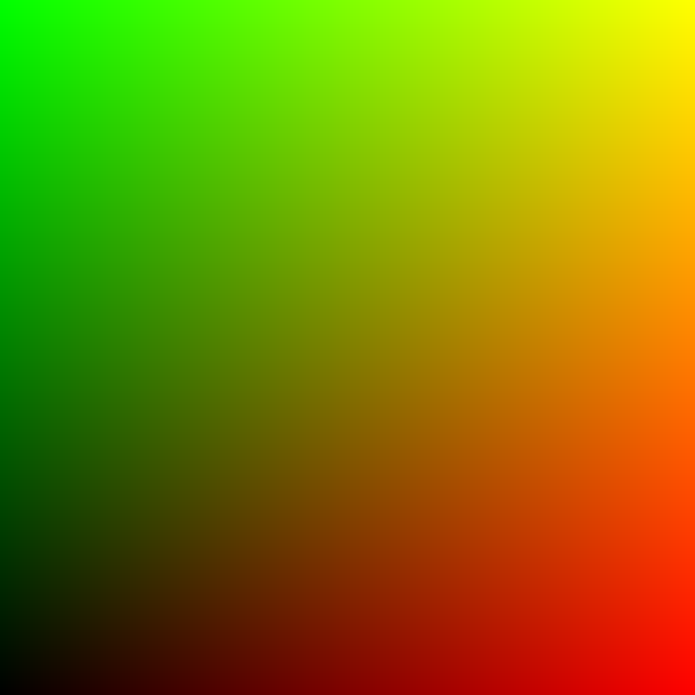
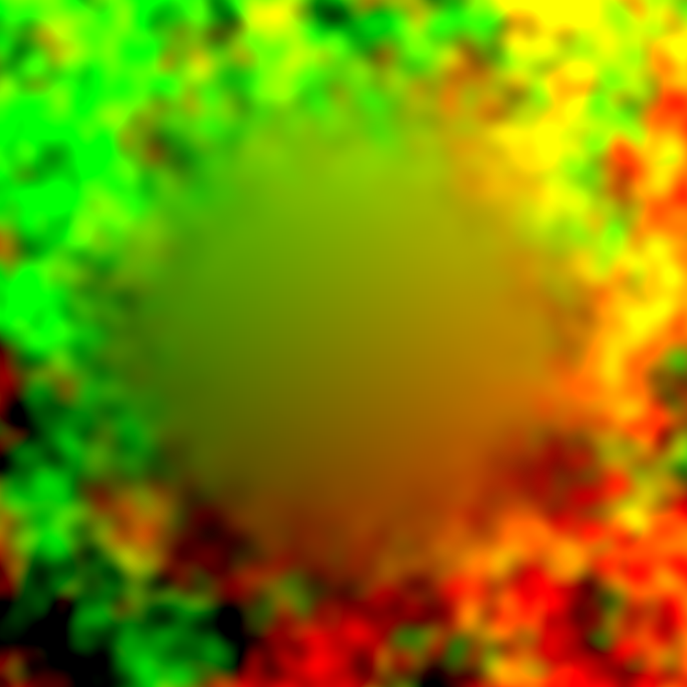
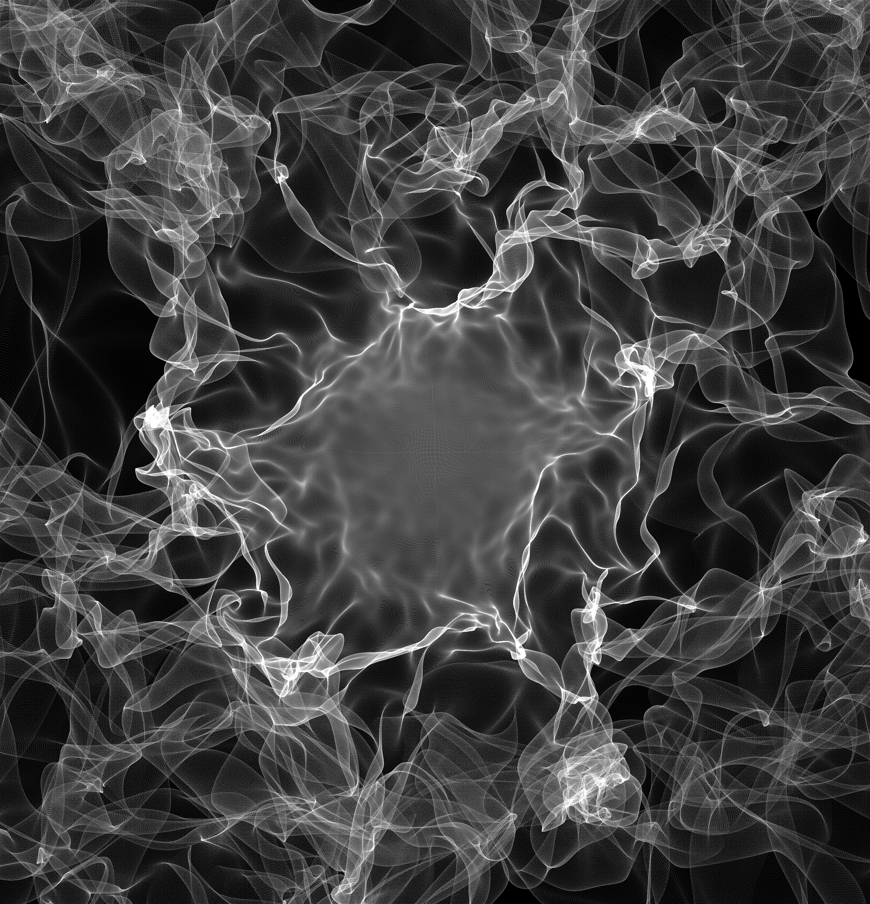

# Tutorial - Noise Plane



```text
vec4 uv = vec4(vUV.st, 0.0, 1.0);
```


```text
float scale = 3.0;
float offset = 0.0;
float n = TDPerlinNoise(vec3(vUV.st * scale, offset));
vec4 noise = vec4(0.5 + n, 0.5 + n, 0.5 + n, 1.0);
```


```text
float cone = sqrt(pow(vUV.s - 0.5, 2) + pow(vUV.t - 0.5, 2)) * 2;
if (cone > 1.0) { cone = 1.0; }
vec4 gradient = vec4(cone, cone, cone, 1.0);
```

```text
float pi = 3.14159265359;
vec4 smooth = cos(gradient * pi + pi) / 2 + 0.5;
```

```text
float gamma = 0.5;
vec4 amp = pow(smooth, vec4(1.0 / gamma));
```



```text
vec4 mixed = uv + (noise - 0.5) * amp
```

Render each Pixel as a Particle with Instancing in a Geometry COMP.

Before you hook up the TOP to the Translate OP, go into the Geometry COMP, delete the torus, add a Circle SOP, change divisions to 3 or 4 to create triangle or square, set the radius to 0.001 and enable the Display and Render flag on the OP \(the purple and blue circles in the bottom right\).


Circle radius should be equal to one divided by Render TOPs max resolution.



Keyboard shortcut "a" then "v" in TouchDesigner toggles particle view of TOPs




> Inspired by the [PixelKit](http://pixelkit.net/) project [Particle Noise Plane](http://pixelkit.net/demos/particle-noise-plane/)

