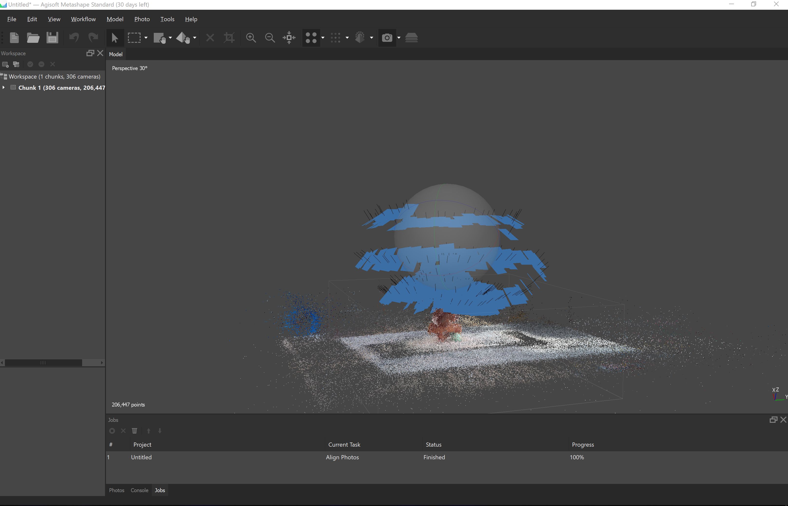

# Point clouds

### What are Point Clouds?

Point clouds are essentially files that contain a bunch of points in 3D space. That's basically at the core. You can think of these points in a similar way as pixels in an image file. Just as a pixel in an image usually has 3 or four channels \(RGBA\). A point cloud file has three channels for each axis. \(XYZ\). Now, a point can also contain additional information, such as a color, a radius, a normal direction or some other type of information, for instance a label telling what this point represents, such as the location of a satellite or a star.

There are several formats that can be used to store this information. Just like with images or video you have different formats. Depending where you get your point cloud from, it can be set to a specific file format. TouchDesigner is capable of handling most common ones, such as PLY and OBJ. 

A common way to store point clouds for instance, is by storing them in the color values of an image. In this case RGB colors actually represent XYZ space. This method also helps to keep performance high \(we'll get to that in the GPU/CPU section\).

### Examples

You've probably spend a moment looking at the colorful image at the start of this article. It is a screenshot of a VR experience done by a collective from London called Marshmallow Laser Feast. Within the VR headset, you get to see nature through the perspective of different animals, turning into a wild and wondrous virtual journey, passing by 3D scanned landscapes.



The way they made this experience, is by using special camera techniques called LiDAR. This is a very quickly rotating laser which scans the area and measures the distance with each beam it sends out. Resulting in a 3D image of millions of points.

After preparing the scene into a real time environment \(in their case VVVV\). They work very hard on shaping this landscape using a computer language called GLSL \(OpenGL Shading Language\). This language is designed to work on your graphics card \(GPU\), and is incredibly fast and good at handling all these millions of points. This is an important part to realize about point clouds, they can be quite heavy to run and manipulate in real time, meaning that depending on the number of points, you'll need a fast graphics card. GLSL runs at the core of most enviroments these days that are handling computer graphics, such is also the case with TouchDesigner and many others, what they all share is a heavy and clever use of GLSL.

The real magic which makes a project like the one from MLF so vivid and impressive, is the way they are able to manipulate the points. By calculating simulated physics, they can add forces such as gravity and magnetism or even behavior you might know from fluids, which influences the points and makes them move and react in a way which gives them character.

[https://quayola.com/work/series/remains-series.php](https://quayola.com/work/series/remains-series.php)

Point clouds don't always have to be shown in real time, or even in movement, to convey an artistic image. Quayola here takes advantage of the still-image format, by sampling an extremely high density point cloud. Which afterwards isn't shown by rendering basic points, but by placing those points into a 3D environment which renders with correct lighting and shadow. Resulting into these ghostly and beautiful images.

### Demonstrate

During this workshop we'll be exploring two ways of making a point cloud. One is using a depth camera called a Kinect, and using a technique called photogrammetry.

### 

### Making our own point cloud

In order to make our own point cloud, we'll need a solid object with ideally a smooth surface and not too many thin surfaces or details. This technique also works for larger things such as buildings, but to keep things simple I'm going to assume you have an object along the lines of a teakettle or a flower pot. 

We'll be using a piece of software called Metashape to do the photogrammetry. Go ahead and download and install the 30 day trial version.



With the trial version setup, lets try to get an understanding of photogrammetry and what steps we need to take.

Photogrammetry works, by having an algorithm look at the same spot from many different angles. By slightly changing the perspective of each photo, the software compares these and tries to make a best guess on how the images overlap. With each perspective shift, the parts of the photo that can be aligned with overlapping pixels, allow the software to calculate the distance of that point. You are doing this all the time, it's the reason we have two eyes, and that they are slightly apart from each other. Your brain compares the two images, and uses it to help you see depth.

Fun fact, did you ever notice how pidgeons move their heads like they're doing some kind of crazy funk walk? That's not the bird seed.. They have eyes which are too close together to see distance if their perspective doesn't change enough. By moving their heads around it helps them to see how far away things are, the \(admit-tingly weird and slightly awkward\) wonders of nature!

Ok, now that you have an idea about what the computer will try to do, lets take a look at how we can go about this. Photogrammetry is great in theory, but in practice, it can be quite finicky, so it requires clean and consistent images to work well. Try to keep the following in mind when shooting your photos.

* Make sure your object is easy to track, ie. not too weird and fuzzy materials shapes and surfaces, be careful with certain detail.
* Place your object in a clear environment without any distracting things in the back or foreground
* Start moving clockwise around the object and begin taking photos.
* Take a lot of images, basically as much as your computer can handle in an ok amount of time. Mine was 300 images, but also took 3 hours to generate at high density.
* Try to get as many angles as possible.
* Make sure to get consistent lighting all around the object, you want to have equally bright colors from all sides.

After you've loaded the photos over to your computer, you can select all of them and drag them into Metashape.

Once its loaded you can click on the Workflow dropdown menu, and select Align Photos. Keep the settings as they are and hit OK. After some moments you should see something like the following screenshot.

Now, you'll see that a lot of the points we got, are from places we're not really interested in. To make sure we're not calculating all those for our high density point cloud, we can change the bounding region using the following tool. Set it to the area you are interested in. 

After you're happy with your bounding region we can calculate the high density version of our point cloud. Click Workflow again, and select Build Dense Cloud. If you're unsure about the strength of your computer, its best to select a lower setting here.

[https://styly.cc/tips/photogrammetry\_discont\_metashape/](https://styly.cc/tips/photogrammetry_discont_metashape/)

### Gotchas

* Resolution limit on free version

### File formats

* RGB data
* XYZ data
* UVs
* Normals 
* PLY, OBJ

### Capturing methods

* Photogrammetry
* Time of flight \(LiDAR\)
* Stereogrammetry
* Projecting a grid
* Structured Light

### Generating and visualizing Point Clouds

* Instancing
* Noise  and sampling



### GPU  and CPU

### Manipulating Point Clouds and GLSL

### Re-meshing

