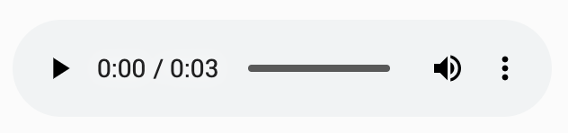

# 1. The Audio Tag

The simplest possible way to play a bit of audio is using the HTML5 `<audio>` tag. In its simplest form, it looks much like an `` tag.

```markup
<audio src="https://www.alexanderwallin.com/audio/pad-5.ogg" controls />
```

This will render a basic player.



Different browsers support different file formats, where WAV \(wave\), OGG and MP3 are most common. As WAV files are uncompressed with huge file sizes, and MP3 sometimes need licensing to use commercially, OGG is a great alternative.

To cover all grounds you can specify multiple sources:

```markup
<audio controls>
  <source src="https://www.alexanderwallin.com/audio/pad-5.ogg" type="audio/ogg" />
  <source src="https://www.alexanderwallin.com/audio/pad-5.mp3" type="audio/mpeg" />
  <source src="https://www.alexanderwallin.com/audio/pad-5.wav" type="audio/wav" />
</audio>
```

Whilst `<audio>` is easy to deal with and will many times do the job for you, it can be easier and more flexible to do things directly in JavaScript.

### Related links

* [Web Audio](https://developer.mozilla.org/en-US/docs/Web/API/Web_Audio_API)

