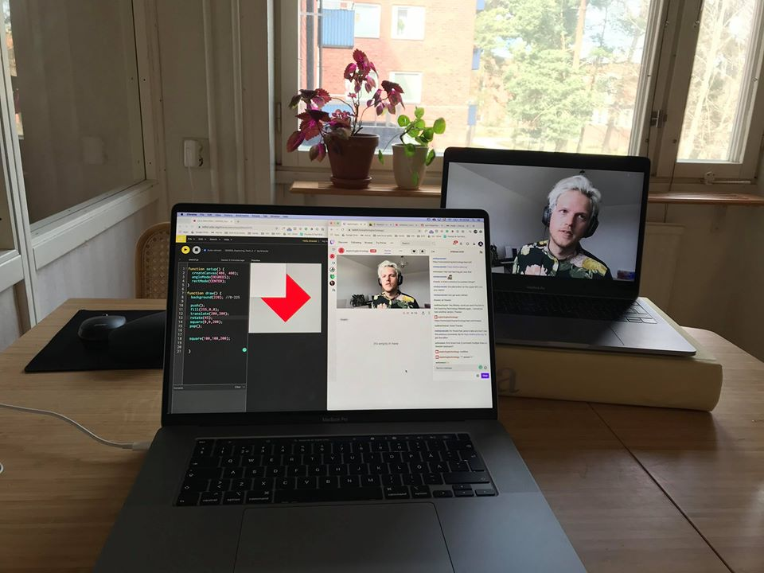

# Live

In April we are streaming workshops on [Twitch](https://www.twitch.tv/exploringtechnology) from Friday April 3 to Friday April 17 at mid-day CET GMT+2. More information in our [Facebook event](https://www.facebook.com/events/524433344931172/).

New to streaming? Check out the [stream page](tips-trix/stream.md)!

## Workshops

| Date | Topic | Host |
| :--- | :--- | :--- |
| 0403 | [Generative Design](learn/p5/generative-design.md) | [Jonas Johansson](https://jonasjohansson.se/) |
| 0406 | Intro to TouchDesigner | [Mickey van Olst](https://mickeyvanolst.com/) |
| 0407 | Browser AR using [A-Frame](learn/aframe/) and AR.js | Jonas Johansson |
| 0408 | Algorithmic sounds with [SuperCollider](learn/supercollider.md) | [Daniel M. Karlsson](https://www.danielmkarlsson.com/) |
| 0409 | [Point clouds and photogrammetry](learn/touchdesigner/point-clouds/) with TouchDesigner and MetaShape | Mickey van Olst |
| 0410 | Machine Learning with [Runway](learn/runway.md) | [Andreas Refsgaard](https://andreasrefsgaard.dk/) |
| 0411 | Live coding networked visuals with Hydra | [Annie Tådne](https://tadne.se/) |
| 0413 | GLSL and Advanced TOP in TouchDesigner | [Anton Heestand](http://hexagons.net/) |
| 0414 | Enhanced radical knitting using JavaScript and the Terminal | [Alexander Wallin](https://www.alexanderwallin.com/) |
| 0415 | Sketch and share Chiptune music with [Beepbox](learn/beepbox/) | [Francesco Torelli](http://www.francescotorelli.it/) |
| 0416 | Painting by numbers: An intro to shaders | Christian Kokott |
| 0417 |  |  |
| 0418 | Projection mapping and audiovisuals in [Resolume](learn/resolume/) | Jonas Johansson |

