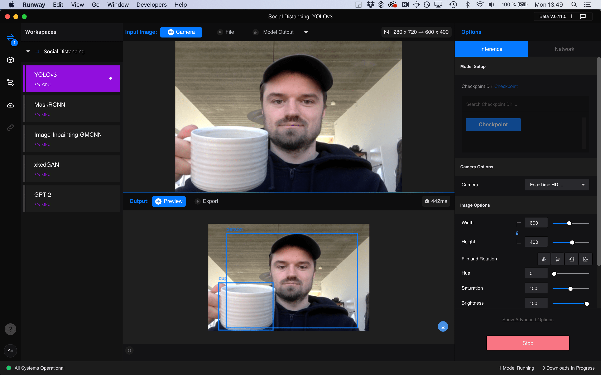

# Runway


Written by [Andreas Refsgaard](https://andreasrefsgaard.dk/)


Runway is a commercial desktop software, that makes it easy to explore advanced machine learning models and running them remotely on Runways servers. In Runway you can:

* **Browse**

  Discover new machine learning models in RunwayML's Model Directory.

* **Train**

  Train your own machine learning models with a few clicks.

* **Experiment**

  Quickly play with machine learning models. No coding required.

* **Integrate**

  Connect your RunwayML models to other applications. 

### Install

Download [Runway](https://runwayml.com/) and create an account. Check out the [Github repository](https://github.com/runwayml) for integration with [Processing](), [TouchDesigner]() and more.

