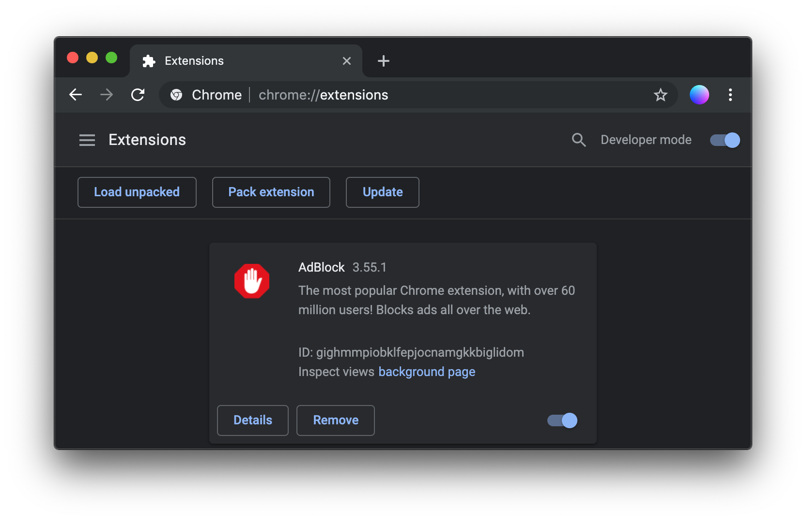

# 🥇 Learning Challenge

Have you ever complained on the look or content of a website or you just want to see some sites burn? Now is your chance to not only criticise the work of others but actively make a change! Work in **teams of two**, download and unzip the [Chrome Extension Template](https://github.com/jonasjohansson/template-chrome-extension) and improve the chosen site according to your standards. When finished, publish a screenshot of the site before and after.




Google has changed their Chrome Web Store and now requires a Developers License and a one time fee of 5$. Ignore uploading the extension for now.


### How to test your extension

1. Open Chrome and type **chrome://extensions** __in the address bar.
2. Turn on **Developer mode** in the top right
3. Click **Load unpacked** and select the template folder.

### How to target a specific site

1. Decide on the site you wish to change, open the **manifest.json** file and follow the instructions.
2. Save the file and reload the package.

### How to change the CSS of a site

1. Open the **style.css** __and make the desired changes, remember too reload the package.

### How to change the JavaScript of a site

1. Open the **script.js** __and make the desired changes, remember too reload the package.

### How to upload the extension

Visit [https://chrome.google.com/webstore/devconsole/](https://chrome.google.com/webstore/devconsole/) and click New item.

