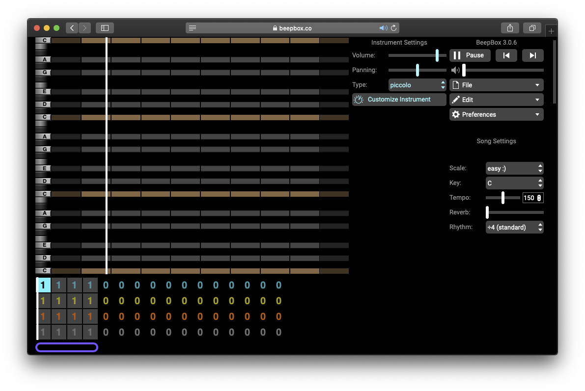
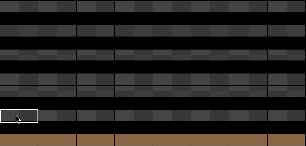

# Beepbox

Audio can be understood in many shapes, music, melody, sound effect or even complete silence. There are several great applications out there for getting started, such as [Ableton Live](http://ableton.com/) \([learning music](https://learningmusic.ableton.com/) - [learning synths](https://learningsynths.ableton.com/)\) and [Reaper](https://www.reaper.fm/). To venture into more unknown territories, have a look at [TidalCycles](https://tidalcycles.org/index.php/Welcome), where music happens through code.  [Beepbox](https://www.beepbox.co/) is a "web app for sketching and sharing chiptune melodies" and a great tool for getting introduced to audio production and music fundamentals. Listen to what others have made through posts on the [Beepbox Twitter](https://twitter.com/beepboxco):

* [WSMN](https://beepbox.co/#8n63sbk0l00e0Pt3nm1a7g0Pj0ui4r1o341320000T0v1L4u00q1d1fay1z8C1w2c0h6T5v0L5u05q0d5f7y5z1C0c0h0HXQRRJJHJAAArq8T0v0L5u00q1d1f2y0zkC2w2c2h0T1v0L2u01q1d1fay0z1C3c0A1F0BdV0Q0000Pff66E053eT1v0L2u01q1d1fay0z1C3c0A1F0BdV0Q0000Pff66E053eT6v4L4u06q2d5f6y4z1C0c0W6hT6v4L3u06q2d5f6y3z1C0c0W6hT6v4L5u06q2d5f6y3z1C0c0W6hT0v5L6u00q1d3f3y5z0C2w0c0h0T6v2L6u06q2d1f8y4z0C2c0W61T1v0L4u01q1d1fay0z1C2c2A8F8B7V0Q021aPcc98E0021T6v0L4u06q0d0f8y3z1C2c4W11T5v1L4ua0q3d7f7y4z1C0c4h0HTP9Bx99sp99900T5v1L4ua0q3d7f7y4z1C0c4h0HTP9Bx99sp99900T5v1L4ua0q3d7f7y4z1C0c4h0HTP9Bx99sp99900T1v1L5u01q0d1fay0z1C2c2A8F8B7V0Q021aPca99E0021T0v1L3u00q0d3fay2zdC1w5c1h4T1v0L4u01q1d1fay0z1C2c2A8F8B7V0Q021aPcc9aE0021T1v0L4u01q1d5fay4z7C1c0A0F0B7V1Q00adPfe39E088bT1v0L4u01q1d5fay4z7C1c0A0F0B7V1Q00adPfe39E088bT0v1L4u00q0d5fay1z0C0w5c0h0T0v0L0u00q0d5fay1z0C0w5c0h0T6v0L4u06q0d1fay1z1C2c0W7iT0v1L4u00q0d5fay1z0C0w5c0h0T0v1L4u00q0d5fay1z0C0w5c0h0T0v4L4u00q0d1f1y2z8C0w0c0h0T0v1L4u00q0d1fay0z0C0w2c0h6T0v4L4u00q0d5f1y2ziC0w0c0h0T0v4L4u00q0d5f1y2ziC0w0c0h0T0v4L4u00q0d5f1y2ziC0w0c0h0T4v0L3u04q1z8666ii8k8k3jSj3uvnnDmGztJiik07JCABrzrrrrrrr00YrkqHrsrrrrjr005zrAqzrjzrrqrAT__-Ir00001bBJ099ijrABJJJIAzrrtirqrqjqixzsrAjrqjiqaqqysttAJqjikikrizrHtBJJAzArzrIsRCITKSS099ijrAJS____Qg99habbCAYrDzh00T3v0L4u03q1d1fay0z1C0S-JIAArrrrrqiiiiT3v0L4u03q1d1fay0z1C0S-JIAArrrrrqiiiiT3v0L4u03q1d1fay0z1C0S-JIAArrrrrqiiiiT3v0L4u03q1d1fay0z1C0S-JIAArrrrrqiiiiT2v1L3u02q0d5fay5ziC1w1T2v2L4u02q1d5fay2z1C2w1T2v2L3u02q0d5f6y7z8C1w1T3v0L4u03q1d5fay1z8C1S1jsSIzsSrIAAT__T3v0L4u03q1d5fay1z8C1S1jsSIzsSrIAAT__T2v2L4u02q0d5fay2zkC1w4T2v2L4u02q0d1fay2z1C2w0T3v1L4ufaq1d5fay1z7C1SjPrrW9V800ah0a0T3v1L4ufaq1d5fay1z7C1SjPrrW9V800ah0a0T3v1L4ufaq1d5fay1z7C1SjPrrW9V800ah0a0b288xw0g0002c005akEM00oW4CexiS080o0300w000000y6800300010000000oVA000124a-4p0DmMh344gQw000004ch13ao03w0xa4GmNE000007fx6g9RJv00000000000My248gx6gFzEgx000iFiBakFr6co1z60000000000x24000080000000000000000Nz6012Ce024EkNHDw0000148gN24gEx248Mz7et2lboBiSKt5PTiw8gxy48w00000xz6goNB0coNz6cpw00sVQGkF0Nz60oNz6cwNza002w008gx248h1248gx20001248gx6g000000gx248h001qRy2c90z2kMgx24oi7eti48gx24IoNzmc64oi165M00p2ES5PuzWyEgP2I4GtYFoQHQPAPAOztCqpFSCGpFGCkrAOteVNWpUiyxdQWCpuVbYzl2bWGELGGy-GGdPprlllleqZGGOGGGGOG1f0pGGGOGHaGGGHaGzM3qGGIGGOGGGGOGEY1jSGGOGHaGGGHaGzOGGGGOGHaGDd6ll6KWt_AqkGpFBevcFKPLdsjNtCLO1ahh0000000000000kQuNgc72lRRRRRRRRRRRDnnnnnnnnnnnnnnnmJtttttttttttttttqKrnrkGOOaSOdPq_JAyVTVtvTnVHKIvF_vInWf180AWLR_v-fUigjjTUX1jbGvt-zXG2tv62CqpFCCqpFCCkZ_eQOqqfqEa3xaWWWWyeg8X3b0009kYuzSwhjHBVCkBd7nhhgCzVFUBpd7vgDLUs6kQuBShtvYOrRl3dvVaqfnC2CqznBfB-qCzUJEjnZ5-5YNFU-O9fvQUmZaKnHU_xfXyS-COSVf7U9jdcFZvBurqXhGCu_TLaWaaVr4m49PqbqbtytyJCGyzi0aCpaqpDNyZTwvIKyCOyyyyyw0000001jhW174d4ChOp70At97opoAt55Bx7ohQ4tx7opoRkl4t97ihRCmCR-1OOeOyEzH8X2eAzIcIqGayeAzE8Wieg8WPb4XdCzZ8OeCieCieChbYEzAiewzJ8XieION8WaaaOewzAyeAzGcIQO-QVRdmaj5AOdKpd-jn8ISLXFAuvjrrpjnplpqPn-XAS7lrjqPbRfdrBBlBBIMMclmnDvvjn2P3jjrcddXCR_12YPNtCLT18EIMlf7EZMskWVupB9jhSQkk9E-qu9mjhTk9X-735d7FtAnn_cCZlgPn-iCzRVwFCERNjVvCFE-bq4R_hvxvcqufIyjTZe5L2HBW-fUj-UJLFIJKjN-2kPjavnVn6DeQqFDLKXOKyyKX4v0sSySyToDoHpGEEQw2FCiCChYoLtU7XbEFz7EEBGqrxjuzK2yZ7800000k6LIl550QkkcSLxI2Ef5ZCjW_rqGqfxf7xnjdcVmllcQPyBB52KFYuFZJlfEZumr4QuDphhiDzYSCqpX6mlfBZcrd7ZfwMplkPjelUAvOISiFB-zUkGDLWVf7y4iDnbGI2qfCZdvC9AFUYFGrYFDaEpE-cFAQSLP4td8DBWKnNVtEi5d7ItR5dd5dddd4ECOZf41IIEFFEFFFFEe35cLZ50J0J0J550J0J0J550J0J0J2qD4jnWa0000000000002wZ7S8jFTgnW_8iKGGEQQvlkMAtldh7lkhQR4th6FQXd7Ar50IcdNMqDyXfHYjyXOufFDFCCqCSCqpFDi5yVCLu_xwHlfH-WubHDEEScSykOsTaN7aOcDcOyeBqcyyOPaPcH9OcP9OYEzFnaEGOsz9OcDbOyeBdHYaCZ7bld7MyzpPaasDbOIPaOcDcOyeBqcyyOPaPcH9OcP9OYEzFn8OcOyP9OYHcOIz9PcEzFnaEGOsx97jAX6jAUzBpuknE00000000009QWtsNVjkV2nFRWHabNOGOy_aHabYGIELOGOyYsGIELOGOy_aElcKl2Vl2VgKlgKkbgbgaelmSnVlphvBlx5Blx3BlC5UFJvyO3K7tRdjWnVlphvBlB5-lmkCLZ7rINqpcmCiCCj5FANqpahFANqpcmCiCCj5FANqpW8QQvUXtVFjBlB5elmkbBlB5elmkkVlpgEVlppjBlB5elmkbBlB5elmkkVlpgEVlpFjBlB5elmkbBlB5elmkkVlpgEVlpFjBlB5elmkbBlB5elmkkVlpgEVlphjBlB5elmkbBlB7azBlKQ2Q2Q2Vlpl0J0J0KlmlgbgbgbBlPve7JTNx7gbgbBlBk2Q2Q2Vlpl0J0J0Kln6soeTv6k2Q2Q2VlpJ0J0J0KlmpgbgbgbBlPEKMbgaeRiv5_DzJKKa5EScyzqHdTrXtTtFfvBjwYkf6pNl0J0J0KlmlgbgbgbBlBk2Q2Q2Vlpl0J0J0E000000002pqicwLEduwLE8NeDKcKwONjhI9B8cn8cKwOW3b6wOW3bE8W2ewONEcKwOW2ewzEcIk_EXg8FESy-wLE8W2-wLE8NpESbjagbgbAPA2Q2VcV0KjegbgbgaC8yyyywwEEEEE81WALEbW2ezKhq1sD9asD957Cp8-o5Op8Ywn9AzFAzO1sCswmwn9D850000000000000058E4bgaAF85iagkV0KgkF8Scwmwmwl9vgfckk2Q2Q2Q2Q2Q2Q2Q7gzgbgbP0L45egbA5fcp1KCCZ78n8EikI8B8EhnAp52bKi000000000000000000jbjhC5Z1HQ5Z169BQ5Z1vhhhghQ4oCngnQ5Z17gnQ4oCngnQ5Z55517ghypt1vghQ4t17ghQ4oQ8B8Ocz8EOcz8Oacz8Ocyz8Ocz855urI2Q2F5F5Ohq1q1q1q1kkp6gbIyV8J0J0FFII1EjnIp56guhhA9HO4f7_OaaYHG1q1uX5Ohq1sAn95E5oEO9haiaAmAn95E5pEO955BA9EO4lV6gyROczoO4kp0CKFERPp2CzmmgvA2bgbkbgb82O0J0J0JUJ0JgJ0GnnF14OQQpNvghQ4t17gpo00000000000) by [@naisusumeru](https://twitter.com/naisusumeru)
* [The Queen has Fallen](https://beepbox.co/player/#song=8n63sbk0l00e03t2nm0a7g0fj07i0r1o321222000T5v1L5u05q3d7f7y6z1C0c4h0HT-Ih9jrh900000T5v1L5u05q3d3f6y1z1C1c0h0H_RBHBziiii9998T3v1L5u03q1d3f8y2z9C0Sp99f9c9Vppbaa9gT1v1L3u01q3d7f9y1z7C1c0A9F4B0V1Q19e4Pb631E0067T1v1L3u01q3d1f9y1z1C0c0A0F3B7VjQ0201Pf431E0112T5v1L3u05q3d7f8y1z7C1c0h0HU7000U0006000ET3v1L4ug5q1d7f7y0zbC0S9irsAABJJJJJJJIT3v1L5ugaq1d5f5y2z6C1SarABJSSSSSRJIAzT3v1L3uf5q1d5f7y1z6C1S1jsSIzsSrIAASJJb4zg00000000id0000000018Q000000004zg00000000id0000000018Q000000004h400000000h4g000000014h00000000p24oFKDUAtbdQ-3ldQ_k3MeIQbdQ_7cSLSD8XOAWAZ_V_gan0BV5cbdQ_QISLSQMes0KJHStDl8VN5yA64bdvR9vj9v8H5ZypvJRdvwU0NU3wPyozybwoxNlzbW9bUApi-0py-VKDMm0bckbWGbMFKD-wJkzHwqrnMqHqgFE-yeEzAOeAzwyeAzG8WifmhQAt9724t97ihMp78Aug8X2eQzF8XieAzAyeAzQ4sEhQAt9734tp7ihQAol1QYWsI1jnD6LgPtenw2CzebW2ZCLbNCWsCg0) by [@woobiex](https://twitter.com/WOOBIEX)
* [Untitled](https://www.beepbox.co/player/#song=8n62sbk0l00e0Lt2Am0a7g0Lj0ji1r3o23324200T0v1L6u00q1d0f3y6z1C2w6c0h0T0v1L6u00q1d0f3y6z1C2w6c0h0T0v0L3u00q1d1f6y2z1C2w2c0h0T0v0L3u00q1d1f6y2z1C2w2c0h0T0v0L4u00q1d1f6y0z1C0w3c0h2T3v0L4u03q0d1f7y1z7C0SU005040woo22190T0v0L2u00q1d1f6y2z1C3w3c0h2T0v0L2u00q1d1f6y2z1C3w3c0h2T1v0L6u01q1d1f8y4z7C0c0A0F2B4V7Q4190Pf646E0111T1v0L6u01q1d1f8y4z7C0c0A0F2B4V7Q4190Pf646E0111T0v0L4u00q1d1f6y0z1C3w0c0h2T0v0L4u00q1d1f6y0z1C3w0c0h2T2v0L4u02q0d1fay0z1C2w1T2v0L4u02q0d1fay0z1C2w1T2v0L4u02q0d1fay0z1C2w1T2v0L4u02q0d1fay0z1C2w1b248gx248gx248gx248gx248gx248gx248gx248gx0002C4o8gx248gx248gx248gx248gx248gx24000kB2l9gtpBI0000001pBI00059gBik7kB2lCmNpBI00000008gx6gp00008gx6gp00000000000x248gxewp1B6M8gzep2k2eg0gyep2jE68xjGewow1288hEa4wi16g9218g8OA8g92z8cxgz2kx2C2c9gAac92z6coO5288x16coMy2g8wx6k8i36koNA8cphx24gy22000004002000002000020000000020000000000p2hPhkOY2QnkQQyQ2QkQQQyQ2QkQQQyQ2QkQQQw000002CnSWCCCCCCCCCCAXBHAWqqqqqqqqjMlAWWqqqqqqqqjMlJGFFFFFFFFFf1mOGCCCCCCCCAY5o6kFFFFFFFFFf1g00005Xt3xPSfrtR1e2uSLElX1lFE_WGqWmqfQczHKYahNCL_Si-h9JFySFrJcJcmIFCCqpFDqqPolYQjAPjdcQPISLiHjbdvjd4QjjfAGkPAPhdcQj-4SkQQQQRkOdlttsBnRQN1jljpjrjljnjpiLrQvz6oo00mqeKG9FCyie1oqpFAzw62CqpFCKWpFArC2yqpFC6GCqpFCFmCqpFCCqpFCCmAqCqpFAzFCCqp8W9ECCieCqpFA00000kQv5Rdddddaq390GwF4ai2AgF4aUah2kOZlSnrJIAhMJttp7shRRRKY511nxaqPBxap9dg4FEeL642CzWZF2SF2VsA2FEf1A2wI4Cbwa91uAgnRLsjpT45D43N9d81lAQA58xigkE58xnAR1dgjflSmMc3qhRlBZ1vghLuyRyQyQyS2QyR2S2R2RyR2SyS2S2S2QyJlY4bllkbllkblkhTll2TRl2TyQyR2QyLnkbj8LeGA6jwGCzVtF45ax0FFKm02bB-grcKhQb2c0IzoLlyVB2RQkKpuVIFwkC0nr5MCVw5ONsa5R1tGxqp57MSh8WEiIzkQ7bKWkyeF8zW1j8aQy0005eLn5dcBdcBdcBdcBdcBdcBdcyQOaQObj8JcyQObj8JcyQObj8JcyQObj8JcyQObj8JcyQOaQOkQOkQOkQOkQOkQObj8JcyQObj8JcyJcBdcBdcBdcyQObj9jj9jj9jj8JcyJcBdcBdcBdcyQObj8JcyQObjdcQPjdcQPjdcQPjbjdcQPjdcQPjdcQPjdcQPjdcQPjdcFR9D9CCqpFCCqpFCCqpFCCqpFCCg0000kApO9kclf6mxB2XuibJTB2XuibJTB2XuibJTB2KTAyXtVgKTAyXtVgKTAyXtVgHi4y4kapFCCkZVdLeAveQhVh7BkhVh7BkhVh7BkhKkhVl4ukhVl4ukhVl71GqcEzOG8YEzOG8YEzOG8SpiYFCCqpVCw00005i-v60Z6Rks7uAKs0oy000000) by [@scheideggerlyd1](https://twitter.com/ScheideggerLyd1)
* [Adventure-ish](https://beepbox.co/player/#song=8n61sbk0l06e0nt2cm1a7g0zj0fi0r1o1312220T1v2L4u26q1d5fay0z7C0c0A1F3B9V7Q0546Pf867E0111T1v0L4u94q1d2f7y2z1C0c2A9F5B5V6Q290dPa883E0011T1v1L4u60q1d6f4y1z6C0c0AbF8B7V6Q0471Peb9aE0001T1v0L4u92q1d4f7y2z1C0c2AbF6B6V9Q0490Pb976E0001T1v1L4u92q1d4f7y2z1C0c2AbF6B6V9Q0490Pb976E0001T5v1L4ua2q3d7f7y6z1C0c4h0HKTTz99irrqih90T4v1L4uf0q1z6666ji8k8k3jSBKSJJAArriiiiii07JCABrzrrrrrrr00YrkqHrsrrrrjr005zrAqzrjzrrqr1jRjrqGGrrzsrsA099ijrABJJJIAzrrtirqrqjqixzsrAjrqjiqaqqysttAJqjikikrizrHtBJJAzArzrIsRCITKSS099ijrAJS____Qg99habbCAYrDzh00b248gx248gx248gx248gx248gx00000008xAaoW4GmM8xAaoW4GmQ000000000000000000008xA28pg00000000000000000000000000248g000000000000000000000008xAaoW0001aBI0000000000248gy6k8xA28pgy6g8xB200000000000012488gx248gx24gx200000p26iFILFd7x9JvPqSJE00kTjV0CRZ0zjhZFBVjkZuc8-8FGOPnYRB4uROzOzUg8-aGGPPnYZDAuPj0Y08YCGL43nXekhWBPnduc8-0rGIIRWq_PyuuTKpHHFGAKsXvesPKrePRvyKbULrWKGGCGLHuPPffr-PJtnUzyuaSZ1Q7yhjq_2rbUjhYr6NIt2SdzoSdzEeNIr6NItLoSdzoSewr6NIr6M02CO-4Qu4CR-JHqSw01jtfA2rnQ2dd7SCnBdjRUMzUyCHbdvPmkhXnafafx0zUGGHfdvPSuhXdc3M0zOqGYgdvIVh7GndsRUMzU1KGOPnYNpJbQR-zjvOGtmR8xjuz_ob0U7000KqcDL8QQp5mhl4ughVlkhV5mhl4ughSqcGy_9O9cKCi_9O9cI00) by [@nameisnamesake](https://twitter.com/NameIsNamesake)
* [Lil' synthpop](https://beepbox.co/player/#song=8n63sbk4l03e0dt1Rm2a7g0nj07i1r1o421222000T1v1L1u01q3d3f7y1z1C0c2A9F3BaV8Q5428P8ef5E0ff9T1v1L1u01q3d3f7y1z1C0c2A9F3BaV8Q5428P8ef5E0ff9T0v2L4u00q1d5f9y5z6C0w4c0h6T0v2L4u00q1d5f9y5z7C0w4c0h6T0v0L4u00q3d5f6y1z6C1w6c0h0T0v0L4u00q3d5f6y1z6C1w6c0h0T1v2L6u01q2d0f8y0z1C0c0A1F9B4VbQ1003Pfc0aE029bT1v2L6u01q2d0f8y0z1C0c0A1F9B4VbQ1003Pfc0aE029bT5v1L2u05q1d6f6y1z7C0c0h1H0506000700Ew34T5v1L2u05q1d6f6y1z7C0c0h1H0506000700Ew34T6v1L4u06q3d1f8y3z1C1c2W69T0v1L4u00q2d5f7y0z8C1w5c0h0T4v0L4u04q1z66i6ji8k8k3jSKSSRJJIAArih98h07JCA__________000108000000001005zrAqzrjzrrqr1jRjrqGGrrzsrsA099ijrABJJJIAzrrtirqrqjqixzsrAjrqjiqaqqysttAJqjikikrizrHtBJJAzArzrIsRCITKSS099ijrAJS____Qg99habbCAYrDzh00T3v0L4u03q1d1fay0z1C0S-JIAArrrrrqiiiiT2v3L4u02q3d5fay0z8C0w1T2v3L4u02q3d5fay0z8C0w1T3v1L4u03q1d5f9y3z7C1SjPrrW9VdGHs0M0ZT3v1L4u03q1d5f9y3z7C1SjPrrW9VdGHs0M0Zb000w004h0h4w00000000004h8j50000000028x8y4y8g0000000000000h4g0000000000000h4g0000000000cPgh4w00000h4x4i4h8h4w0000004x4i4h8h4w00004h4h4h4h4h4g0000p26RkQu30QRgVvbOddB97hkhFPtdddl97hkhw0bdvPrd7Pc2gM90nQP1A4yfrJ_RTnsygih0VtD7QPyp0hOh0nN8KUMA6jdN33unSX1A4ygmX8zRSCzYM9uhntodefFD4O0zALcI0kQvRdddddddRtdcPh3jiSSQQQQQQOQgkQSSTTw0bdvPIBttRn3bmFRT0Hw02PnYX9nnttMqRGttMaU00GrBuLa2pukWYiFInHwEpcXewPAX7aUXz_7U-KO-KNuLzZgkj5Jvjn-FE-861bW8ihGHFFIAv9efEN8zAzb05CzeMzsQpcQbAQbhejd4ulh7APgKlgJ4V4QPall4KN97IjgKjgJ4VlkhV4Auhl5-hmjlrkQO00BXCLcHO-GGbWGELGGALGGy-CGbWqEOTd6hd0096Phw016Cz0iewzE8YE0zOyeg8Wg00) by [@raupebanner](https://twitter.com/raupebanner)
* [In the Depths of the Sea](https://beepbox.co/#8n32sbk4l04e0qt1Lm1a7g0zj0ei0r1o32100T1v1L4u99q3d7f6y3z1C0c0AcF8BcV9Q4200P6789E0000T1v0L6ub5q1d2f7y1z2C0c0A5F4B6V9Q0001PecaaE0099T0v0L2u00q0d1f8y0z1C2w1c0h2T4v2L4uf0q1z6666ji8k8k3jSBKSJJAArriiiiii07JCABrzrrrrrrr00YrkqHrsrrrrjr005zrAqzrjzrrqr1jRjrqGGrrzsrsA099ijrABJJJIAzrrtirqrqjqixzsrAjrqjiqaqqysttAJqjikikrizrHtBJJAzArzrIsRCITKSS099ijrAJS____Qg99habbCAYrDzh00T4v3L4u04q1z6666ji8k8k3jSBKSJJAArriiiiii07JCABrzrrrrrrr00YrkqHrsrrrrjr005zrAqzrjzrrqr1jRjrqGGrrzsrsA099ijrABJJJIAzrrtirqrqjqixzsrAjrqjiqaqqysttAJqjikikrizrHtBJJAzArzrIsRCITKSS099ijrAJS____Qg99habbCAYrDzh00bcPci4x8iu4l5hkmr2M2zc00004ki4x8i03pUCFLdX-04k000cPci4x8idQl5hkysHaLjc0008y8h4h4h4h4h4h4h4h4h4000000h4h4h00004h4jgQPcI000p2eHKrF-GjAHkKrQvN7ILeop5eVKD-TDd7PvSEYVJvzusR_BluTEX08fT5WeNSToyyBu5HbA4MHFGlVGpylQ7Eam0GHwZ7h5b2VE-GELjbRgVBUGIHoCJGqSmqDKNqm0lCUfCXXImsHKrYCIFIL9Hlt7d6qeg9E-86CRZIx5djRN4QR_jCRYgcq-WDaLbYBCyyCO-QR-wCzQkT7-X55jkPtVjtfMCzUGRQRerbWBdYRcVnGuRXnYlmTnueNp7FF-VE-aGKGY_Teq_SqsQvQQVK__BfUZtsPhUllTlPSzNtTpaXRXsvTlbfq_CGORTxqRR6ptY2HQ5ZAXGM5mad5kzatfv0GW5PcOSBcFE-GFeKGhFHkO_hYijq_td7X19Lb-GjzWABZOGmpuNqklZ5jn-f2gkRcFQRtjd7Y7_ddj_r9R9BW5jhYrddliCzYvGtdB_T9H_Uhd7TKXB5NW2yLollYzks0EIJhRQRe3l9lllgJqrnXFKfUY9jtfPjhUl17hghFBUEEEO2eyywzUyCZ7YFKDYxarbVHJjn_9E_ARfQ3w9pB8V4Fd29mdykyAYhhIjAFB8VxykytDyczC9VDyaeoD9EEUyu9VyzoD9EhbhjptaAloF2rbEOcxd7g00FEXydCzpMLOIGBcImFd7ghIQrl4qCnbkCmyxCmCG9VGVEWe0bSqeCidd6lKnp6CzHjhAsTx7Rh7AQhSqfGmpvWpB8LyrOrFKCmqCCCpqrSqFJcFfsnTdQTTdYPtdQOPkYRjf4PsQpBuFR2DmVESeJd6lN6kCzasQtsQCz0uaOQYpJV6TPjcF6kOCkBClykOBVlpmllPhKj-NOxmNKrCVDB5nIXt-4pCTKpPdRJrtsNCrCVDcpCVE6shlVdkO3T557B6hAp555556hAkp6hgCmz8EjbNAr6hhAr5dBA9EWcz8Ocz8O0) by [@durgess\_\_](https://twitter.com/Durgess__)

### Install

Beepbox \([link](https://www.beepbox.co/#8n31s0k0l00e03t2mm0a7g0fj07i0r1o3210T5v1L4ua3q1d4f7y5z1C0c4h0HTP9Bx99sp99900T0v1L4u86q1d4f9y0z9C0w6c0h3T1v1L4u30q1d5f9y1z7C1c0A9F4B0V1Q19e4Pb631E0067T4v1L4uf0q1z6666ji8k8k3jSBKSJJAArriiiiii07JCABrzrrrrrrr00YrkqHrsrrrrjr005zrAqzrjzrrqr1jRjrqGGrrzsrsA099ijrABJJJIAzrrtirqrqjqixzsrAjrqjiqaqqysttAJqjikikrizrHtBJJAzArzrIsRCITKSS099ijrAJS____Qg99habbCAYrDzh00b4h400000000h4g000000014h000000004h400000000p16000000)\) runs in the browser and requires no installation.

### Setup

To get a better view of the interface, open **Preferences** and select **Full-Screen Layout** and **Show Piano Keys**. Change the scale to any of the "Normal" options under **Song Settings**. Scale defines the notes available, with **Normal** and easier ****making only room for "harmony safe" notes. 

### Sequencer

In the bottom there are **4 rows** and **16 columns.** Each row has a color, corresponding to an instrument. **Teal/Yellow/Red** can be set to any type of instrument, while **Grey** is used for percussion. Besides the color there is number containing a unique pattern. Each instrument can have ten different patterns 0-9.  All highlighted cells have patterns, with 0's are empty.

Click any of the cells and look at **Instrument Settings** to change the instrument.


The purple selection defines the amount of columns to be included in the playback and export.


To play music, "draw" notes on the notes on the piano roll by click, drag and release on any selected cell. Click **Play** or hit **Space** to listen.

After drawing a note it is possible to modify it by dragging up or down, obtaining a **Glide Effect**, removing the interruptions between notes as the pitch will slide between different values instead of jumping. You can find this function in several synths, and can also be called **Portamento**.

Every row \(besides gray\) has a **different octave** with red being the lowest and teal the highest; meaning it is preferable to use red for bass lines and harmonies, while teal and yellow are ideal for melodies and arpeggios. As we said before, grey, the bottom row can only contain percussive sounds.

### Save

As soon as a new file is begun it is given a random URL containing all the data. Write down the link or export as JSON as this file can be imported. When ready, export a WAV file under **File** and **Export Song…**

_Let's understand some music theory to be guided during the writing process!_

