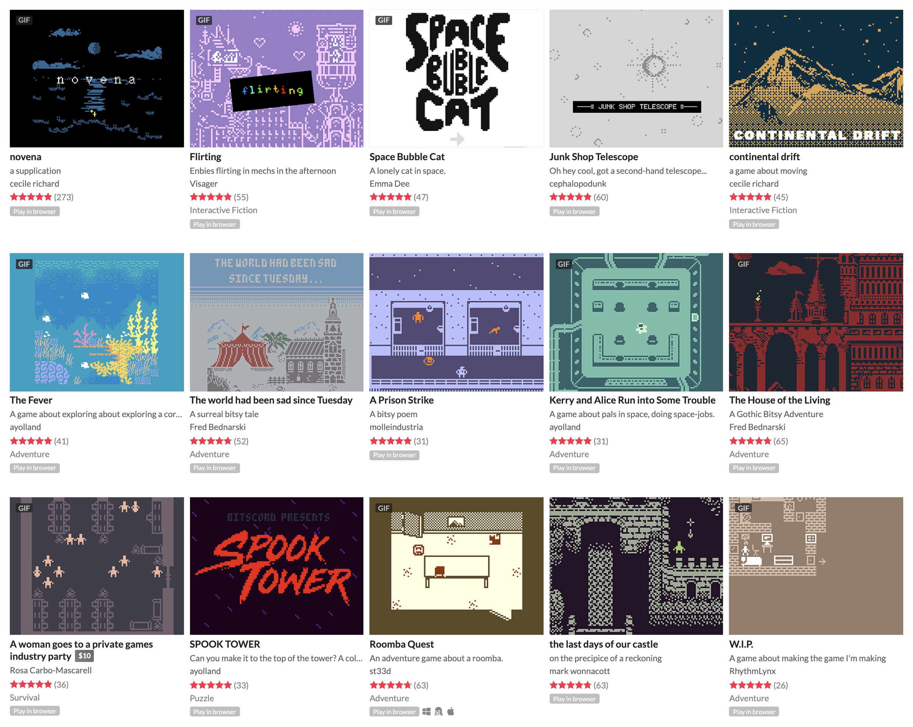

# Bitsy

### Bitsy on the forum



> Bitsy is a little editor for little games or worlds. the goal is to make it easy to make games where you can walk around and talk to people and be somewhere. — Adam Le Doux, creator of Bitsy

Games made in bitsy range wildly in their size, scope, and genre, but it works especially well for short narrative games, little vignettes, or games about being in one place and wandering around. 

Bitsy is defined by its constraints. It has limited interaction, only three colors, and very little programming. The pixel canvas is tiny. However, this simplicity is incredibly useful for making focused and deliberate ideas. It gives every choice a lot of weight. Because it is so simple, it is also a great tool for prototyping ideas, or getting something down on paper right away. 

