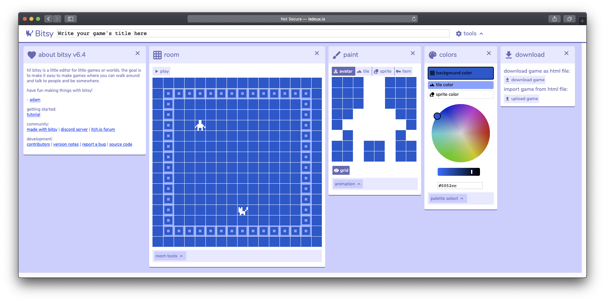
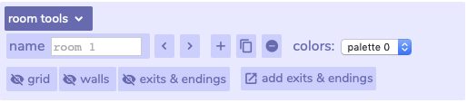
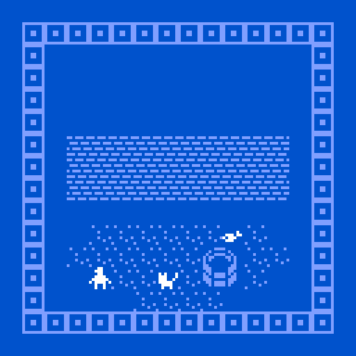

# Basics

## [Editor](http://ledoux.io/bitsy/editor.html) ****

* **Top**: Edit the name of your Bitsy project
* **Room:** The level editor which your player will move in.
* **Preview:** A preview of the code, triggered by clicking **play** or ticking **Auto-refresh**. It is possible to change the size of this window by hovering just where the code and preview meet, then click-and-drag.
* **Colors**: Bitsy uses only 3 colors; Background, tile and sprite, but can have multiple palettes.

All windows can be rearranged and closed. Click on Tools to see a list of windows available! Hovering over anything brings up a description.

In the **room** window, hit the play button. You should be able to move the character around with the arrow keys. Walk over to the cat!


This is currently a heavy copy & paste from a [guide](https://docs.google.com/document/d/11pfwuJ8GR1RViwL1nkvbD7pEqokDH9RLtamzxrsJuEc) written by [Everest Pipkin](https://twitter.com/everestpipkin).


## Paint & Colors

Stop the game, and look over at the **paint** window. The paint window, the canvas, is where avatars, sprites, tiles and items are drawn. Click any pixel in the avatar, and it will disappear. Click it again and it will come back.  
****

If you expand the **animation** option at the bottom of the drawing window, you can add a second frame! The other tabs in the paint window \(tile, sprite, and item\) work in the  same way. 

Look at the **colors** window. Picking the colors for a project can be one of the most important parts! It sets the mood and ambiance of the space. You get three colors; **Background**, **tile** and **sprite**. You can also have multiple palettes, for different rooms. 


The default colors are: **\#0052cc** \(background\), **\#809fff** \(tile\) and  **\#ffffff** \(sprite\).


## Tiles & Sprites

Go back to the **paint** window, and click on the three other options beside **avatar**. These are **tile**, **sprite**, and **item**.

* **Avatar** is the player character.
* **Tiles** are the scenery. They are not interactive, but can be set as a wall. Your character cannot walk through walls, but can walk anywhere else. The squares around the frame are tiles.
* **Sprites** are interactive tiles. they are usually used as characters in your game, or things like signs which have writing. Running into them triggers dialog, like our cat.
* **Items** are like sprites, except that you pick them up when you run into them, and can be used later on as variables.

Go to **tile** and hit the plus symbol. This will make a new blank tile. Name it **bricks** and draw a brick pattern. Click the wall button beneath the canvas to make it so that the player can’t walk through it.  Toggle **grid** to more clearly see the end result.

Then click in the room window to place these brick tiles. Try making a wall.

Now do the same thing with some speckles for dirt, making sure that the wall button is not clicked.

Let's add an item. Click on **sprite** in the same paint window.  Sprites have the option of dialog, which triggers when you bump into them. Create a new sprite, give it some dialog and add it to the room.

You can place tiles and items multiple times, but sprites and avatars only once. If you want to place a sprite twice, you need to duplicate it. You can also animate any of them. See everything you’ve made so far in the **find drawing** tab. Try building an environment out of tiles and sprites and exploring it with your character.

## **Rooms & Exits**

Although you can certainly make a game in just one room, Bitsy also lets you string together multiple rooms to make a larger space or tell a longer story. You can assign different color palettes to different rooms to give them different feelings. At the bottom of the **rooms** window, click on **room tools**.   
****

Now hit the plus button to make a new room. It will be completely blank. Go to your tiles in your **paint** window and make a quick little space in your second room.

Click the left arrow at the bottom of the **rooms** window to go back to your first room.  Now, back in your first room, click **add exits and endings**. A new window will pop up. Click **+ exit** and then click on where in your room window you want your exit to be.

In the **exits & endings** window, you can select what room the exit goes to. Select your second room, the one you just made. When you hit the **move** button below that room, it will allow you to place the exit in your new room, in your room window. 

Hit play, and try it out! Walking over the exit square should teleport you into your second room. You may pick what “direction” your exit works. It can work both ways \(walk back and forth like through an open door\), or just one direction \(a decision you can’t take back.\) You edit this in the exits & endings window, by clicking the center arrow between rooms.

You can connect as many rooms as you’d like in this way, and you can place multiple exits in one room. You can even have your exit teleport you to the same room, but in a different place.  ****If you want to delete or move an exit, you can drag it around, delete it, or edit where it goes in the ‘exit’ window.


You may also set **transition styles** in the exits & endings styles, which change the animation when you change rooms.


Remember that it is usually a good idea to visually signify your exit somehow! Make a door, staircase, well or cave entrance to start. Then think of other possible exits that your character can take.   
****

## Endings & Saving

If you want your game to have an end, you will need to make one. Again, select **exits & endings** and hit **+ending**. These work exactly like exits, except that they have dialog. You can have multiple endings in your game! The game will start over once the ending is reached. 

Now that you know what your game is, be sure to give it a title. That’s the text box at the very top of the screen. **Play through and admire your work.**  

**To export your game so other people can play it, go to the download window in the tools. This will export your game as an html file. You can upload this to a website or just click on it on the desktop to have in launch in a browser. \(You can also load a bitsy game from a previously exported html file.\)**  

**If you want to keep working on your game, you will need to save the game data. this is the text data that represents logic, pixel art, and text of your game. In the game data window, you can chose to download it or just copy it into a text file.**  

**\(If you want to see how bitsy loads information from this file, try changing a few numbers around and seeing how it affects your game.\)**  

**Because bitsy saves this information to the browser, you probably don’t have to save if you’re using the same computer \(like your laptop\). You can close the window and come back. That said, it is a good idea just in case- and if you are using a shared computer always download this data.**   

**🌿 Part 5: Dialog in Bitsy**   

**When you make an item or sprite in bitsy, you can set their dialog in the paint window. But if you need more complicated dialog options, you can open the dialog window for further abilities.**   

**Select a sprite in the paint window to edit its dialog.**  

**Long dialog:**  

**Adding additional dialog windows means that your characters keep talking. They can talk as long as you have material for them to say.**   

**Text effects in dialog:**

**There are 6 built-in options. Clicking one sticks the code block in your text. Your text needs to be wrapped between the two curly bracket delimiters for it to show up styled- like so:**

**{wvy}my text{wvy}**  

**You can have multiple styles of text in one dialog! They stack!**  

**Lists in dialog:**  

**Lists let you have lots of different things for your characters to say. The three options are sequence, cycle, and shuffle. They’re pretty self explanatory, but:**  

 **Shuffle - picks randomly between the lines of dialog.**

 **Cycle - runs through each line of dialog in order, repeats.**

 **Sequence - runs through each line of dialog exactly once, doesn’t repeat.**  

**Important: If you are not seeing changes you are making, refresh the page. If you try to change the dialog while the game is running, sometimes it stops saving changes and you will have to refresh to have it start again.**   

**🌿 Part 6: Items & conditionals**  

**You’ll need to use both the ‘inventory-&gt;items’ and ‘dialog-&gt;conditional’ windows.**   

**In the inventory window, you will see a list of all the items in your game. \(You make these in paint - the example was a cup of tea.\)**  

**Items are collectables. When you walk over them, they disappear with an optional line of dialog. Bitsy keeps track of how many of each item you have collected. You can see the number next to your item increase as you walk over them in your game.**   

**In the conditional window, you can set the dialog to be different depending on how many items of which type you have picked up.**  

**Setting the above statements in the “conditional” of the dialog window changes my dialog to this:**   

**You may write your if/else statements out, or simple generate them via the “conditional” interface.**   

**\(On “Fetch quests” -- &gt;** [**https://youtu.be/gVbPHgsO2S0?t=53**](https://youtu.be/gVbPHgsO2S0?t=53) **\)**  

**🌿 Part 7: Variables & conditionals:**  

**You’ll use the ‘inventory-&gt;variables’ and ‘dialog-&gt;conditional’ windows.** 

**A variable is essentially a place for your game to store information. Think of it like an empty box we can put values in, to check what those values are later. This lets us do logical operations like “did we already talk to this person”?**   

**Here are the basics:**  

**You can define a variable from the inventory window.**   

**You can then use this variable in the ‘conditionals’ section of the dialog window.**  

**Curly brackets- {} - define code blocks in Bitsy.**  

**You can set a variable from inside of dialog like this:**

**{variableName = 1}**  

**You can use basic math operators in conjunction with variables.**

**{variableName = variableName + 2}**  

**The operators you are allowed to use are +, -, /, and \***  

**You can also set variables to strings \(text\), with quotes:**

 **{variableName = "our variable is text”}**  

**If your variable is a string \(text\), the only operation you can do is adding:**

 **{variableName = "our variable” + “ is text”}**  

**Variables can be added to dialog using curly braces and ‘say’:**

**“Did you find the {say variableName} yet?”**  

**Math CAN’T be used on variables inside of a conditional, but you can define variables in conditionals.**  

**Each conditional can only evaluate one variable.**  

**If you want to do anything more than slightly complicated with conditionals and scripting in bitsy, you’ll probably need to get used to looking at the &lt;show code&gt; view of the dialog. It will be useful in showing you how your logic flows from one state to another.**  

**A bitsy scripting caveat:**  

**Often there are clever ways to make it feel like you have programmed in variables without actually having to. For instance, we could write a check that sees if you have talked picked up a key before someone tells you a secret. OR, we could put a one-way room exit under a key to an identical looking room with a person with different dialog in it, so that when you pick up the key you get teleported there and they tell your their secret.**   

**It takes a bit to get your head wrapped around thinking that way, but it definitely counts as a solution. And sometimes it is easier to just do it like that! \(I fully support clever design over bad programming.\)**  

**🌿 Continued: More resources, Bitsy hacks and cool things:**  

**A note- these are all pretty fun, but they are often made and maintained by one person and are sometimes buggy, confusing, require some coding, or are under-documented. I’ve listed their “difficulty” to implement by each one.**  

**Add audio \(super easy\):**

[**https://candle.itch.io/bitsy-audio**](https://candle.itch.io/bitsy-audio)  
****

**Upload jpg and png images, get bitsy data \(fairly easy\):** 

[**https://ruin.itch.io/image-to-bitsy**](https://ruin.itch.io/image-to-bitsy)  
****

**A big collection of hacks on Github \(medium to advanced\):**

[**https://github.com/seleb/bitsy-hacks**](https://github.com/seleb/bitsy-hacks)   
****

**“Borksy”, a tool to help implement hacks \(easy to medium\):**

[**https://ayolland.itch.io/borksy**](https://ayolland.itch.io/borksy)  
****

**Random palette generator \(super easy\):**

[**https://zenzoa.itch.io/palettsy**](https://zenzoa.itch.io/palettsy)  
****

**Multiframe sprite animation with Spritesy \(medium easy\):**

[**https://pansandpots.itch.io/spritesy**](https://pansandpots.itch.io/spritesy)   
****

**“Bitsy HD”, a bitsy at twice the scale \(caution- data not translatable from one to the other. just as easy as bitsy, but twice the drawing work\):**

[**https://vonbednar.itch.io/bitsy-x2**](https://vonbednar.itch.io/bitsy-x2)  
****

**“Full screen animation” using rooms \(easy but a lot of work to implement\):**

[**https://zetef.itch.io/full-animation-in-bitsy**](https://zetef.itch.io/full-animation-in-bitsy)   
****

**And here is a link to a FAQ that answers the following questions:**

* **How do I have a locked door that opens once the player finds the key?**
* **How do I have more than three colours in the palette?**
* **How do I have more than two colours per tile?**
* **How do I change the background colour of the text box?**
* **How do I change my game’s title in the game data \(without using the Bitsy editor\)?**
* **What do I do if the Bitsy editor isn’t working?**
* **What do I do if my game looks blurry?**
* **What do I do if the title of my game keeps disappearing?**

[**https://docs.google.com/document/d/1jRz3wgkQU3kZN\_LGChw4UlMWhVoc145J-euBtkr7NeE/**](https://docs.google.com/document/d/1jRz3wgkQU3kZN_LGChw4UlMWhVoc145J-euBtkr7NeE/edit)

**A custom font tool \(medium to hand\):**

[**https://seansleblanc.itch.io/fontsy**](https://seansleblanc.itch.io/fontsy)  
****

**A few advanced writeups on how their games work \(called post-mortems\):**

[**https://blog.seans.site/post/157692325676/how-it-works-holt**](https://blog.seans.site/post/157692325676/how-it-works-holt)

[**https://paolojcruz.itch.io/anon/devlog/22949/anon-post-mortem-notes-on-using-variables-in-bitsy**](https://paolojcruz.itch.io/anon/devlog/22949/anon-post-mortem-notes-on-using-variables-in-bitsy)  
****

**A few really useful breakdowns of dialog and variables in Bitsy, if you want deeper examples:** 

[**https://cephalopodunk.itch.io/bullshit-fish-names/devlog/23122/time-for-some-rambling-about-dialog**](https://cephalopodunk.itch.io/bullshit-fish-names/devlog/23122/time-for-some-rambling-about-dialog) ****

[**https://ayolland.itch.io/trevor/devlog/29520/bitsy-variables-a-tutorial**](https://ayolland.itch.io/trevor/devlog/29520/bitsy-variables-a-tutorial)   
****

**Plus:**

[**https://bitsy.fandom.com/wiki/Bitsy\_Wiki**](https://bitsy.fandom.com/wiki/Bitsy_Wiki) **\(very in-depth wiki of tips, hacks, tutorials, and examples\)**

[**https://twitter.com/bitsypcs**](https://twitter.com/bitsypcs) **\(a twitter account that tweets new games and resources\)**

[**https://itch.io/games/made-with-bitsy**](https://itch.io/games/made-with-bitsy) **\(a repository of thousands of bitsy games\)**

[**https://twitter.com/adamledoux**](https://twitter.com/adamledoux) **\(the creator of bitsy, tweets news and game jam announcements\)**

[**https://color.adobe.com/create/color-wheel/**](https://color.adobe.com/create/color-wheel/) **\(color palette picker\)**  

