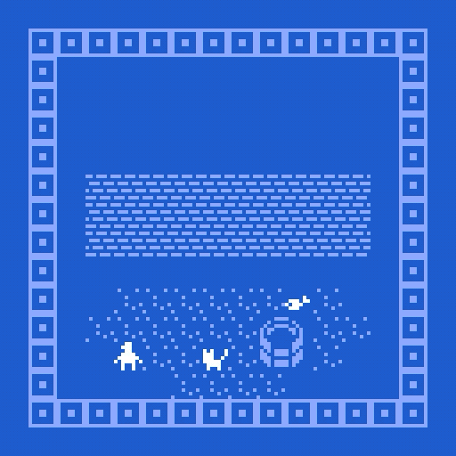

# Ending

If you want your game to have an end, you will need to make one. Again, select **exits & endings** and hit **+ending**. These work exactly like exits, except that they have dialog. You can have multiple endings in your game! The game will start over once the ending is reached. 

Now that you know what your game is, be sure to give it a title. That’s the text box at the very top of the screen. **Play through and admire your work.**

