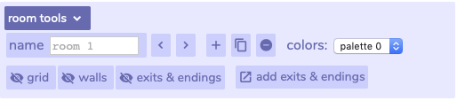
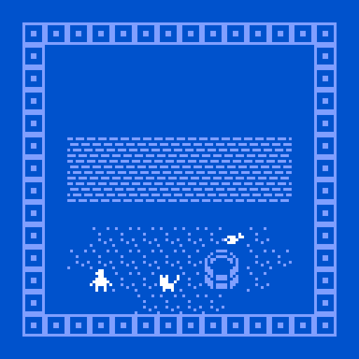

# Rooms & Exits

Although you can certainly make a game in just one room, Bitsy also lets you string together multiple rooms to make a larger space or tell a longer story. You can assign different color palettes to different rooms to give them different feelings. At the bottom of the **rooms** window, click on **room tools**.   
****

Now hit the plus button to make a new room. It will be completely blank. Go to your tiles in your **paint** window and make a quick little space in your second room.

Click the left arrow at the bottom of the **rooms** window to go back to your first room.  Now, back in your first room, click **add exits and endings**. A new window will pop up. Click **+ exit** and then click on where in your room window you want your exit to be.

In the **exits & endings** window, you can select what room the exit goes to. Select your second room, the one you just made. When you hit the **move** button below that room, it will allow you to place the exit in your new room, in your room window. 

Hit play, and try it out! Walking over the exit square should teleport you into your second room. You may pick what “direction” your exit works. It can work both ways \(walk back and forth like through an open door\), or just one direction \(a decision you can’t take back.\) You edit this in the exits & endings window, by clicking the center arrow between rooms.

You can connect as many rooms as you’d like in this way, and you can place multiple exits in one room. You can even have your exit teleport you to the same room, but in a different place.  ****If you want to delete or move an exit, you can drag it around, delete it, or edit where it goes in the ‘exit’ window.


You may also set **transition styles** in the exits & endings styles, which change the animation when you change rooms.


Remember that it is usually a good idea to visually signify your exit somehow! Make a door, staircase, well or cave entrance to start. Then think of other possible exits that your character can take.   
****

## 

