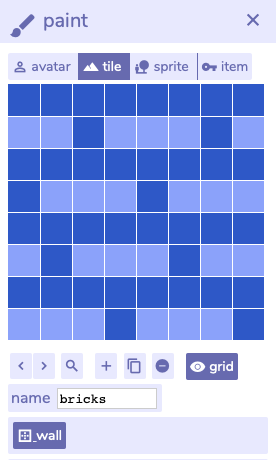
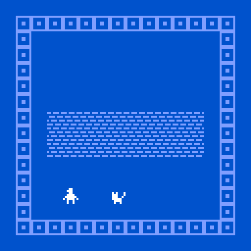

# Tiles & Sprites

Go back to the **paint** window, and click on the three other options beside **avatar**. These are **tile**, **sprite**, and **item**.

* **Avatar** is the player character.
* **Tiles** are the scenery. They are not interactive, but can be set as a wall. Your character cannot walk through walls, but can walk anywhere else. The squares around the frame are tiles.
* **Sprites** are interactive tiles. they are usually used as characters in your game, or things like signs which have writing. Running into them triggers dialog, like our cat.
* **Items** are like sprites, except that you pick them up when you run into them, and can be used later on as variables.

Go to **tile** and hit the plus symbol. This will make a new blank tile. Name it **bricks** and draw a brick pattern. Click the wall button beneath the canvas to make it so that the player can’t walk through it.  Toggle **grid** to more clearly see the end result.

Then click in the room window to place these brick tiles. Try making a wall.

Now do the same thing with some speckles for dirt, making sure that the wall button is not clicked.

Let's add an item. Click on **sprite** in the same paint window.  Sprites have the option of dialog, which triggers when you bump into them. Create a new sprite, give it some dialog and add it to the room.

You can place tiles and items multiple times, but sprites and avatars only once. If you want to place a sprite twice, you need to duplicate it. You can also animate any of them. See everything you’ve made so far in the **find drawing** tab. Try building an environment out of tiles and sprites and exploring it with your character.

