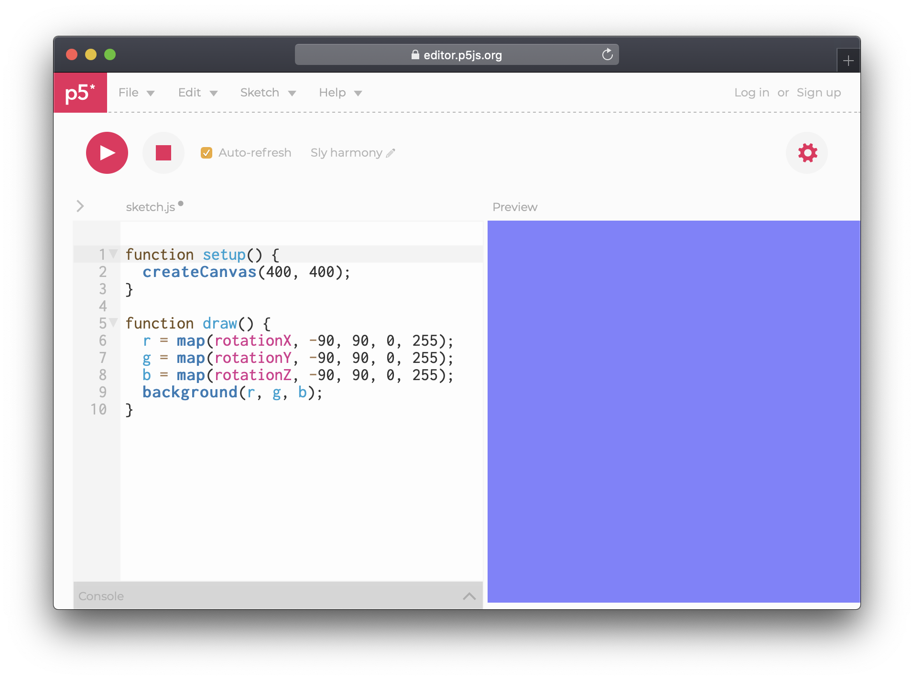

# Interaction

There are several [events](https://p5js.org/reference/#group-Events) that can be "listened" too; button is pressed, mouse is clicked, mobile device is shaken. Some of the events even act as a variable. Such is the case with mobile device acceleration and rotation.

```javascript
function draw() {
  r = map(rotationX, -90, 90, 0, 255);
  g = map(rotationY, -90, 90, 0, 255);
  b = map(rotationZ, -90, 90, 0, 255);
  background(r, g, b);
}
```



By previously printing out the rotation values we see that the numbers go from -90 to 90, and therefore should use the [map](../basics/time.md#map) function to convert into our colour range. Open the sketch on a mobile device to see the background change as the device is rotated.

Due to security restrictions users must give explicit access to motion data. This is normally done by providing a button which upon being clicked prompts the user to for permission.

```javascript
function setup() {
	createCanvas(windowWidth, windowHeight);

	let button = createButton('start');
	button.position(windowWidth / 2, windowHeight / 2);
	button.mousePressed(permission);
}

function draw() {
  r = map(rotationX, -90, 90, 0, 255);
  g = map(rotationY, -90, 90, 0, 255);
  b = map(rotationZ, -90, 90, 0, 255);
  background(r, g, b);
}

function permission() {
	if (typeof DeviceMotionEvent !== 'undefined' && typeof DeviceMotionEvent.requestPermission === 'function') {
		DeviceMotionEvent.requestPermission()
			.then(response => {
				if (response == 'granted') {
					window.addEventListener('devicemotion', e => {
						// do something for 'e' here.
					});
				}
			})
			.catch(console.error);
	} else {
		alert('DeviceMotionEvent is not defined');
	}
}

```

