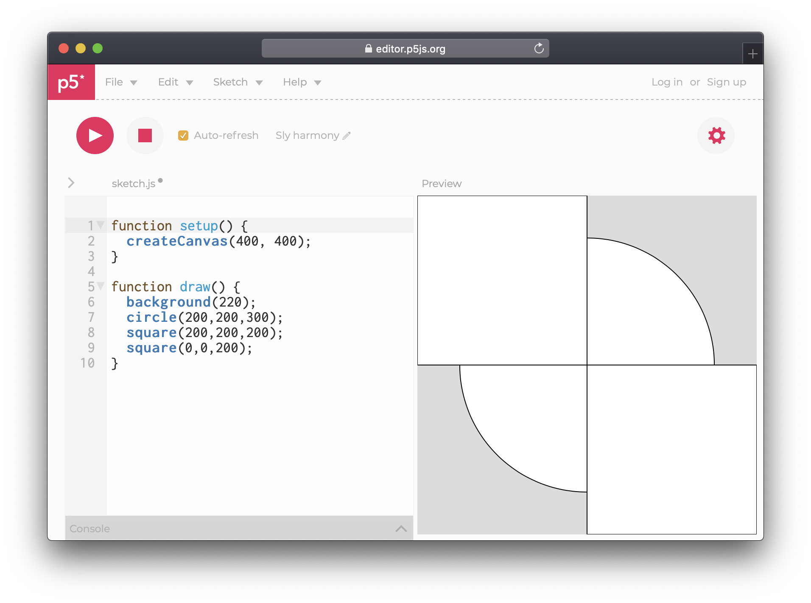
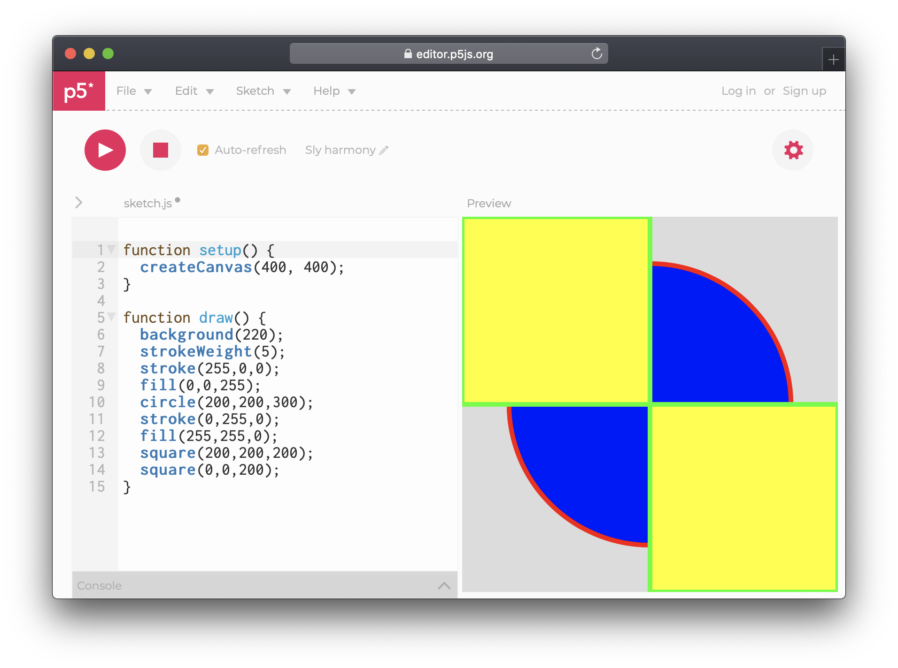
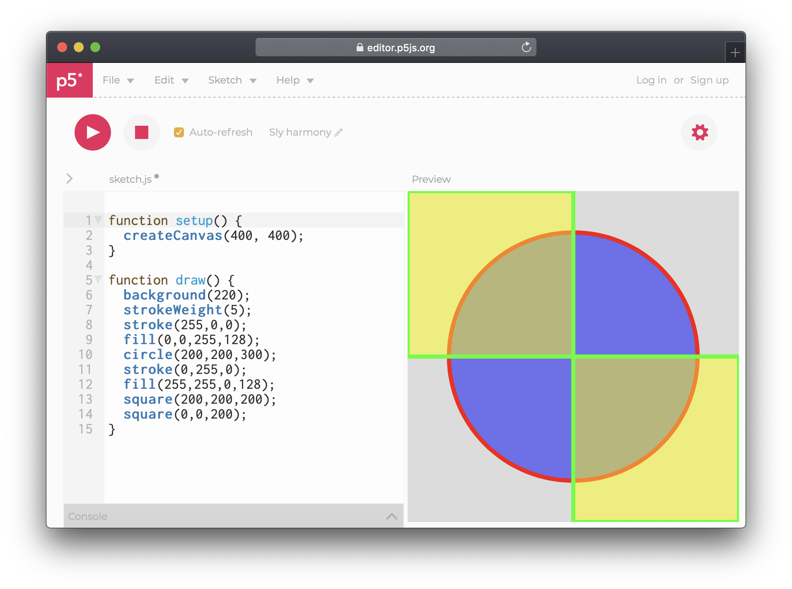

# Basics

## [Editor](https://editor.p5js.org/)

A brief explanation to the editor components

* **Sketch.js:** The name of the current file, and the place where code is written. By toggling the arrow just next to the name, a "folder" structure is revealed. New files can be uploaded here, such as images.
* **Preview:** A preview of the code, triggered by clicking **play** or ticking **Auto-refresh**. It is possible to change the size of this window by hovering just where the code and preview meet, then click-and-drag.
* **Console**: A small window at the bottom for debugging; showing error messages or other types of information.
* **Top menu**: Many options here, but most relevant is File &gt; Save and File &gt; Share \(available only after the project has been saved\).



You can change the name of your project next to the Auto-refresh button.


## Code

In programming, a function is a named section of a program that performs a specific task. In this sense, a function is a type of procedure or routine. 

Processing has two default functions. `setup()` which happens once, in the beginning, and `draw()` which happens forever, until the sketch is stopped. There is also has a bunch of other functions that can be called, these pre-existing functions will be highlighted in color.

```javascript
function setup(){
    createCanvas(400, 400);
}

function draw(){
    background(220);
}
```

In the default code there is also two other functions: `createCanvas(400,400)` and `background(220)`.  Running this example will give us a canvas with  400 pixels width and height, as well as a gray background. The reason it becomes gray is the number 220, which signifies the value of Red, Green and Blue. Since there is only 1 number, it assumes we are defining the value for all three ie. RGB. We can change this by adding commas:

```javascript
background(220,0,0);
```


Notice the semicolon at the end, this tells the code interpreter that the line has ended.


## Shapes

Let us begin drawing by adding a circle. The circle function takes three parameters: x, y and diameter. Type the following **inside draw**:

```javascript
circle(200,200,300);
```

The first two values tell the circle where to be, and the last provides the diameter.  In our case, this will place the circle in the middle of the canvas, as the circle has its centre as point of origin. In this situation 200 pushes the circle centre from the left and top.


It is highly recommended to read up on each function using the Processing References, as they are not all the same.

Besides circles we can also add squares. After the circle line, make a new line by pressing Enter, then type:

```javascript
square(200, 200, 200);
square(0, 0, 200);
```

The first two values here are just like the circle, defining x and y, or, the distance from the left and top. However, squares do not have their point of origin in the centre, instead they "start" at their top left.



## Color

Colors are most commonly represented with RGB \(Red, Green, Blue\) or HSB \(Hue, Saturation, Brightness\).

All shapes are by default white, with a 1px black outline. To change this we use the functions `stroke` and `fill` and add them _before_ our shape. Code is always _read_ from top to bottom, so whatever becomes before the shapes will be applied.


The draw function does not reset itself, and remembers the values set the last time.


### Stroke

Let us make outline of the circle red by typing `stroke(255,0,0)` **before** the circle, and our squares green by typing `stroke(0,255,0)` before the squares. We can also increase the stroke thickness  using the [**strokeWeight** ](https://p5js.org/reference/#/p5/strokeWeight)function with a value in pixels.


To remove a stroke, type `noStroke()` before the shapes that should be without.

### Fill

The shape background color works similarly to stroke. Let us turn our circle blue by typing `fill(0,0,255)` and the squares yellow by typing `fill(255,255,0)` 




### Alpha

So far, we know that we can choose the amount of Red, Green and Blue, but there is also a fourth value: Alpha. The alpha decides the opacity, the amount of "see-through" which our color can have.

The alpha value by default is also a value between 0 and 255. For example at line 12 we set the color to be yellow \(a mix of **R**ed and **G**reen, without **Blue**\), with a alpha \(transparency\) of 128:

```javascript
fill(255,255,0,128);
```



## Transformation

### Rotation

Use `rotate()` to draw shapes in different angles. Keep in mind, rotation is applied to the “canvas” and not to the shapes you are drawing. Think as if we are rotating the paper we are drawing on. By default, rotation is measure in radians, to use angles type `angleMode(DEGREES)` in **setup** to make life easier.


The amount rotated is also _remembered_ and stacks upon itself. This is clearly seen when adding several squares and applying a rotation to each.

### Translate

If rotation feels complex, welcome to `translate`. A genious function in many ways, but difficult to master; translate moves the whole canvas in x and y, and in conjunction with rotate can make a rectangle spin around itself. Let's try the following code:

```javascript
function setup() {
  createCanvas(400, 400);
  angleMode(DEGREES);
  rectMode(CENTER);
}

function draw() {
  background(220);
  translate(200,200);
  rotate(frameCount);
  square(0,0,200);
}
```

Several new things are happening here:

1. We define the rectangle mode to be CENTER, meaning the  origin of the square is in its centre.
2. We move the canvas 200 pixels from the left and top using translate
3. We rotate the canvas, and instead of a static value, we use **frameCount**. A special variable that increases by 1 every time draw is being called.


## Push and Pop

It is possible to _negate_ the effect of a rotation or translate by using the same value but negative, for instance by typing `rotate(-10)` after `rotate(10)`. But, there is also a completely different way of ensuring that functions **only** happen to specific shapes.

Code doesn't have _layers_ like most design software, but we can simulate the effect of a layer using two functions: `push` and `pop`.  Anything that happens inside of these, will not be _seen_ by anyone else. what happens in push and pop, stays in push and pop.


