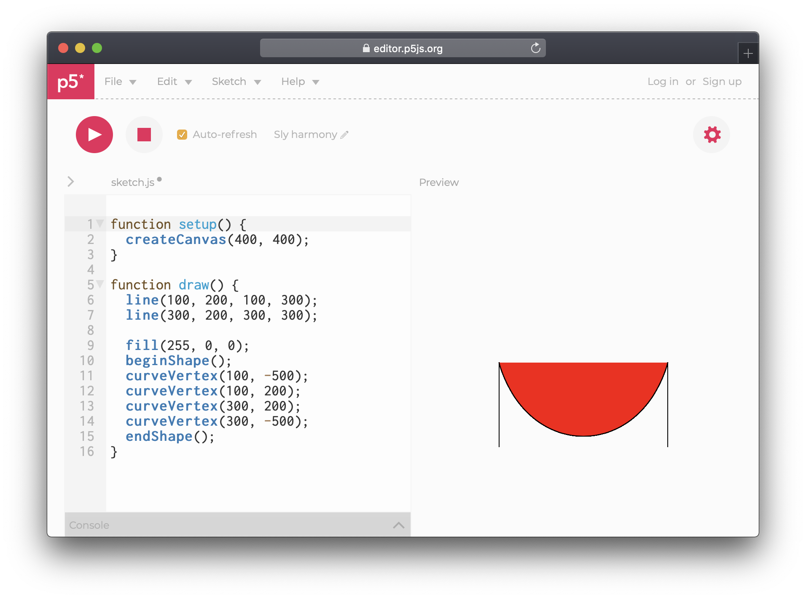
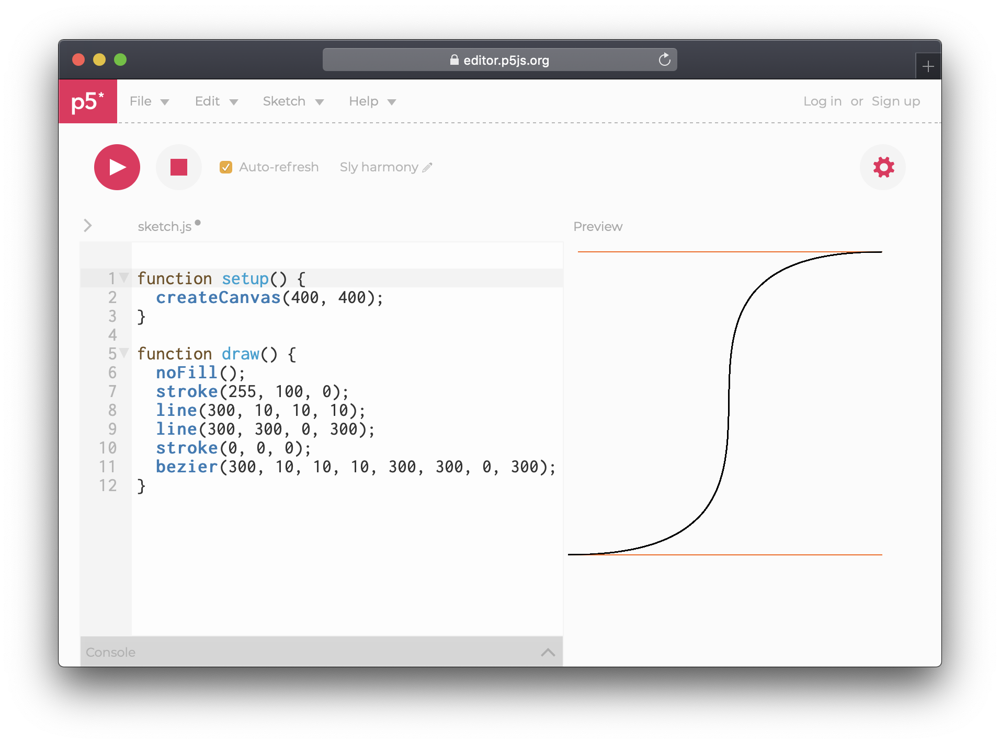

# Curves

It is possible to make curved lines using `curveVertex()` and then use `beginShape()` and `endShape()` to solidify them. The first and last vertices define the direction of the vertices to come, as illustrated by the two lines.

```javascript
function draw() {
  line(100, 200, 100, 300);
  line(300, 200, 300, 300);

  fill(255, 0, 0);
  beginShape();
  curveVertex(100, -500);
  curveVertex(100, 200);
  curveVertex(300, 200);
  curveVertex(300, -500);
  endShape();
}
```



It is also possible to use `bezier()` and `curve()` but these are much more complex to understand and use, as they include the bezier curve values within the function, making it very hard to read. Use at your own risk.

```javascript
function draw() {
  noFill();
  stroke(255, 100, 0);
  line(300, 10, 10, 10);
  line(300, 300, 0, 300);
  stroke(0, 0, 0);
  bezier(300, 10, 10, 10, 300, 300, 0, 300);
}
```



