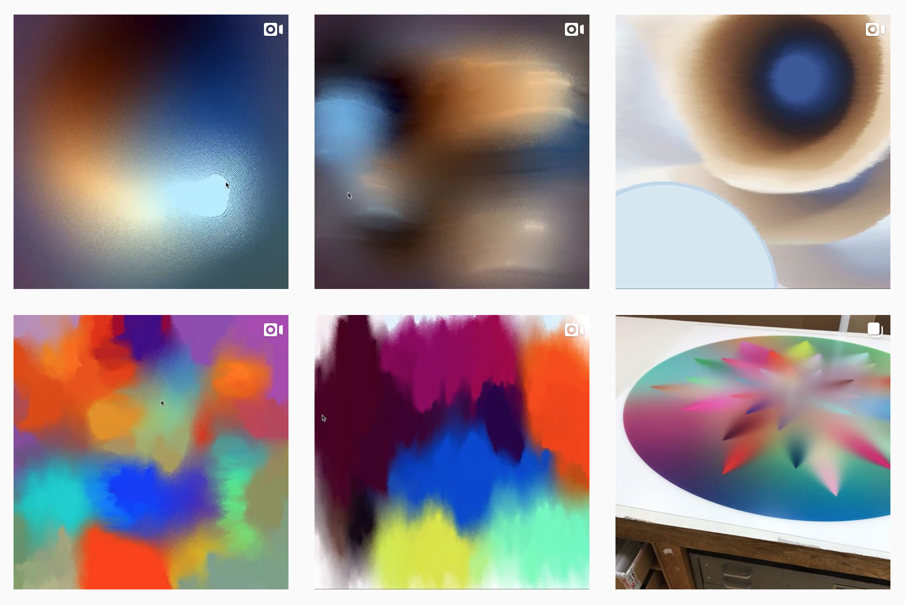
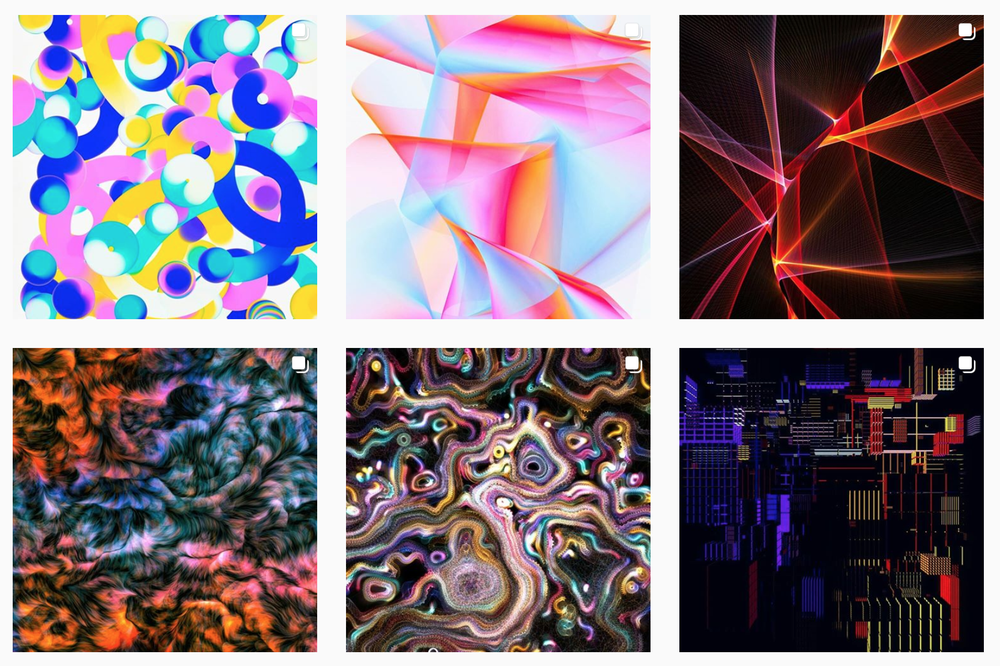

# References

### [Generative Gestaltung](http://www.generative-gestaltung.de/2/)

Fantastic book with drawings and code examples. Most can be found on the website but not all. A definite purchase if you are serious about learning. 

### [Nature of Code](http://natureofcode.com/%20)

### [The Coding Train](https://www.youtube.com/user/shiffman/videos)

Daniel Schiffman is the fire and soul within the Processing community and releases new tutorials weekly. Follow him on his coding train and before you know it you'll be coding away with ease!



### Instagram





### 











