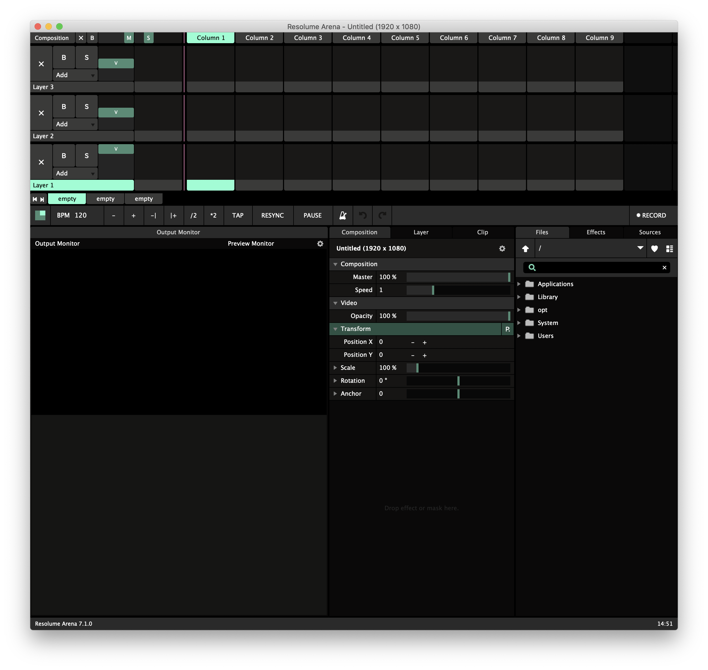

# Basics

Upon starting the application an example composition is presented. A great starting point, but ultimately a possibly overwhelming distraction. To create a new press **⌘N**, or click **Composition** and **New**.

Before deciphering the interface, click **View** and untick **Audio Controls**, **Crossfader, Dashboard, Help** and **Compositions**. Save by clicking **Layout** and **Save.** Name it "Simple". _The interface should now be easier to navigate!_

Here is the simple layout along with an advanced version.





To save this composition, press **⌘S**, or click **Composition** and **Save**. A prompt will appear!

Name the composition and change the **Size** to **960x540**. The values should ideally reflect the final output resolution \(most likely from a projector\), but for learning and experimenting it is less taxing on the computer to run at lower values.

Click **Save** and a new AVC file will be created in the software folder, found under Documents. This file can be shared with others, but the video files are not embedded, so make sure that if collaborating — to also sync media files.

