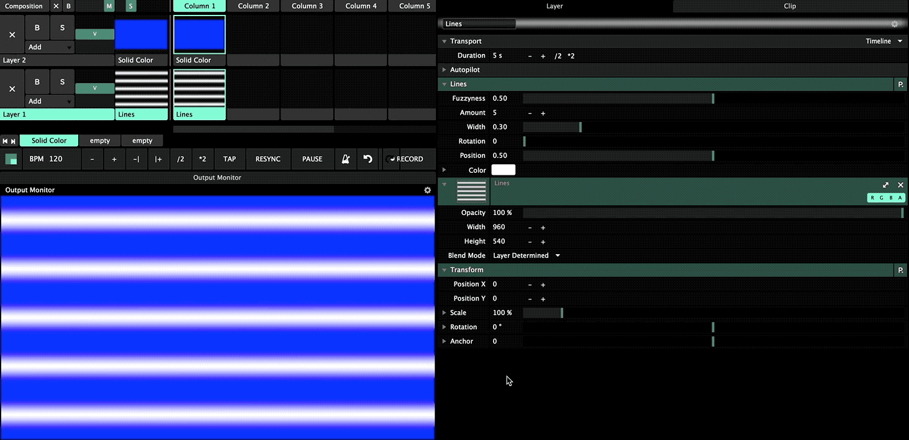

# Animation

Every parameter that has a changeable value \(that is not on/off\) can be animated! Hover the parameter name and a **cog** will appear, click it, and choose **Timeline**  from the menu. The parameter will animate from its minimum to its maximum with a default speed. 

On any parameter, click the **cog wheel** to the left of the parameter name. It will not show up unless the parameter name is hovered.

### Easing

It is possible to define how the animation eases from one value to the other. By default it is set to Linear. Click the **cog** again and choose **Envelope**. Add key frames and set easing modes!

### Audio input

Besides **Timeline** there's also **External FFT**. Choosing this will attach the parameter to the audio input. It may work immediately, but just to make sure, go to **Preferences** and choose **Audio**. Make sure **External Audio FFT Input** is set to **Input 1 & Input 2** \(or something along those lines\). 

The **Audio FFT Input Gain** decides the amount of input amplification. Increase it to make the mic more sensitive.

