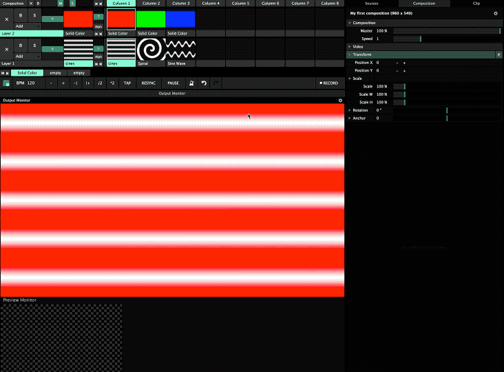

# Transitions

Just like with music, the experience lies in the seamlessness, and beautiful transitions is a wonder to experience. But, how to make them? Click **View** and **Show Layer Transition Controls**. It will appear in the layer window next to the active clip. The Time \(**T**\) input is small, but each increment counts, and decides the length of the transition. Just under there's a set of transition effects, by default it is set to **Alpha**.

_Add a few clips, increase the time and click them in order to transition!_

In this example the top layer blending mode is set to **Multiply**, causing the colors to colorise the layer below.

For some excellent examples of great musical transitioning, [listen to John Digweeds show Transitions](https://www.mixcloud.com/johndigweed/).

