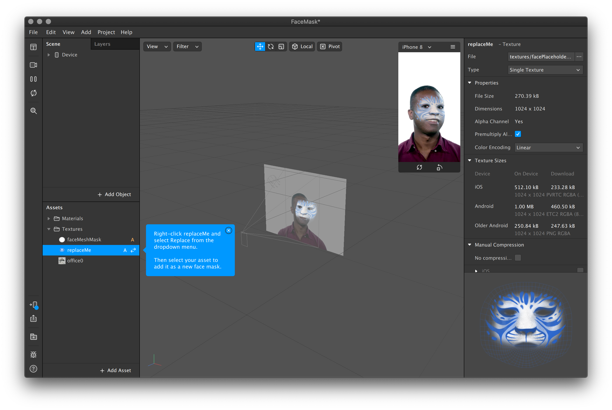
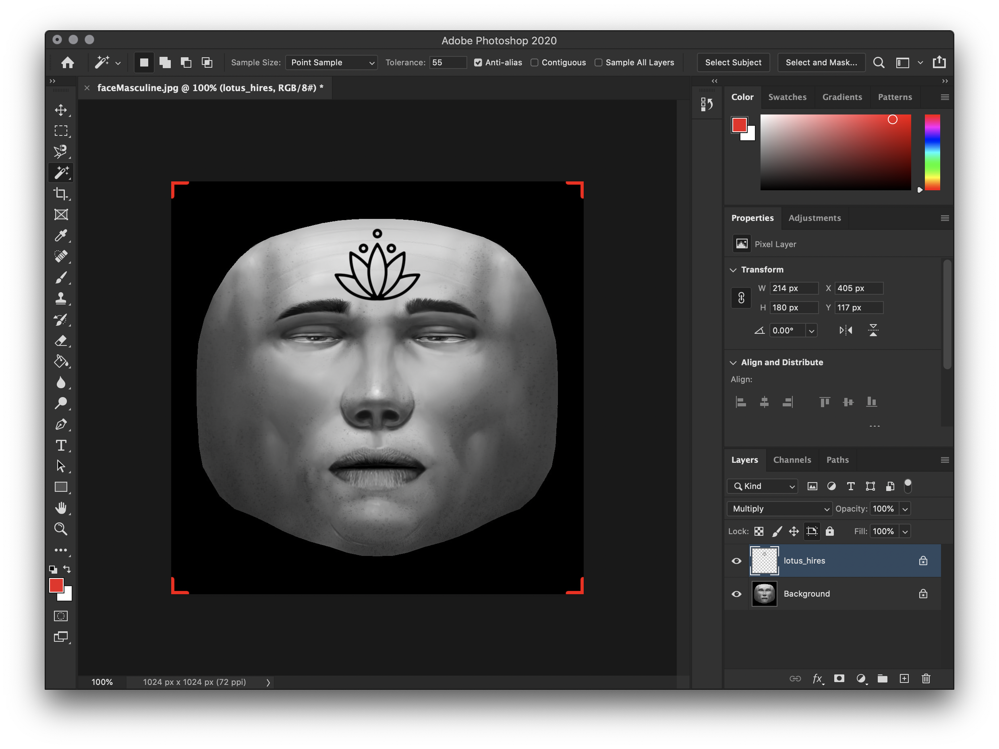

# Face Mask

A **Face Mask** is a **Face Tracker** combined with a **Face Mesh**. Use the template Face Mask project or build one from scratch using the [Face Tracker](https://sparkar.facebook.com/ar-studio/learn/documentation/tutorials/quick-start-guide) tutorial. Also have a look at these:

* [Split Face Effect and Alpha Mask](https://www.youtube.com/watch?v=OHBQYAr79Dc)
* [Face Distortion and Retouching](https://sparkar.facebook.com/ar-studio/learn/documentation/tutorials/face-distortion-and-retouching/)
* [Create filter effect with Face mesh, Retouching and Lighting Effect](https://www.youtube.com/watch?v=RapfrXtyliU&feature=emb_logo)

To allow for multiple faces in the same camera view, duplicate the Face Tracker once ready and make sure the duplicated Face Mesh references the new Face Tracker.

### Change Texture

1. Download  the [Face Reference Assets](https://sparkar.facebook.com/ar-studio/learn/documentation/before-you-start/basics/using-the-face-reference-assets/)
2. Open either **faceFeminine.jpg** or **faceMasculine.jpg** in your preferred pixel design software
3. Create a new layer and draw your design
4. Export as PNG and replace the texture in Spark

