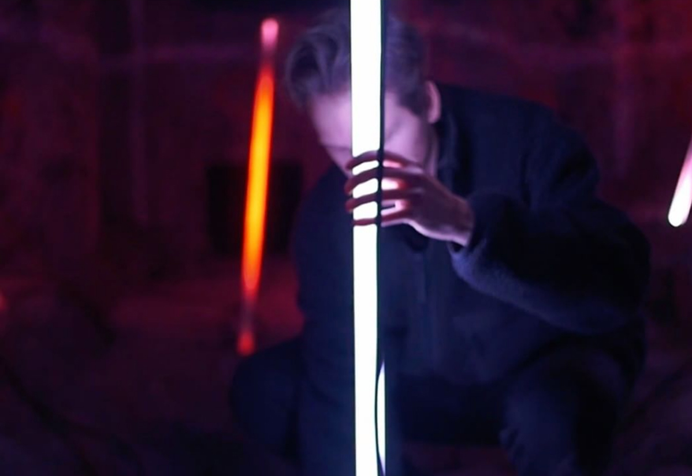

# Team

### [Jonas Johansson](https://jonasjohansson.se/) \(Industry Leader\)

Anywhere based artist, designer and programmer transforming light + technology through → play, biology and \(un\)human intervention. Hyper alumni and Industry Leader at Hyper Island since 2016. Part of [Nordic Audiovisual Artists](https://nava.community/) and [Svartljus](https://svartljus.se/).

### Mattias Petter Johansson

The host of Fun Fun Function, popular show about programming, Mattias has been around and will join Exploring Code as a guest lecturer on topics that are dear to him.

→ Check out MPJ [live](https://www.youtube.com/channel/UCO1cgjhGzsSYb1rsB4bFe4Q/videos)!

### [Tim Rodenbroeker](https://timrodenbroeker.de/)

The term "Creative Coding" symbolises the link between the arts and experimental software-development. In this intersection an unexplored, fascinating universe comes to life. And it is here that Tim applies his skill and shares his experience.

→ Check out Tim [live](https://www.youtube.com/watch?v=JW7oAbLVNJE)!

### [Katarina Ljungdahl](https://earthpeople.se/katarina)

Been writing code since 2016 with 10 years prior experience in communication and design. Currently at [Earth People](https://earthpeople.se/) creating user experiences for clients such as Vimla, Red Bull and Klarna.

### [Owen Hindley](http://www.owenhindley.co.uk/)

A true jack of all trades working with software, electronics, light and sound to create cutting-edge experiences, shows and games. He were part of the team creating [Kassinn](https://amaze-berlin.de/), an interactive theatre experience in VR, and is a leading [Horizons VR](https://horizons-vr.com/) building interactive music journeys. He is also a web developer who has worked with leading studios such as [FIELD](https://www.field.io/), [Universal Everything](https://universaleverything.com/latest) and [B-REEL](https://www.b-reel.com/).

### [Alexander Wallin](https://www.alexanderwallin.com/)

TBD

### [Peder Fjällström](https://pederfjallstrom.com/)

Host of the annual [Stupid Hackathon](https://www.stupidhackathon.se/) in Stockholm and working as Creative Technical Director at design agency [Familjen](https://www.familjen.se/). Co-founded and ran the digital agency Earth People up until April 2019.

## Class representatives

<table>
  <thead>
    <tr>
      <th style="text-align:left">Week</th>
      <th style="text-align:left">Who</th>
    </tr>
  </thead>
  <tbody>
    <tr>
      <td style="text-align:left">20-24</td>
      <td style="text-align:left">
        
<a href="mailto:david.lopez@hyperisland.se">david.lopez@hyperisland.se</a>
        

        
<a href="mailto:tom.backlof@hyperisland.se">tom.backlof@hyperisland.se</a>
           <a href="mailto:lina.wang@hyperisland.se">lina.wang@hyperisland.se</a>
           <a href="mailto:emilio.hellberg@hyperisland.se">emilio.hellberg@hyperisland.se</a>
           <a href="mailto:nazduygu_gozen@hyperisland.se">nazduygu.gozen@hyperisland.se</a>
        

      </td>
    </tr>
  </tbody>
</table>