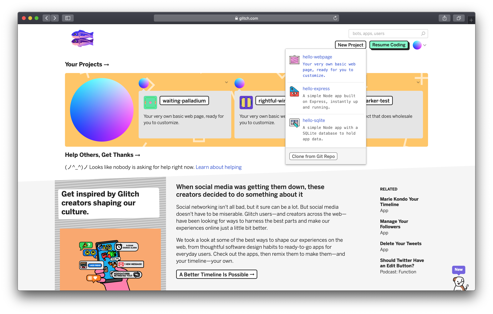
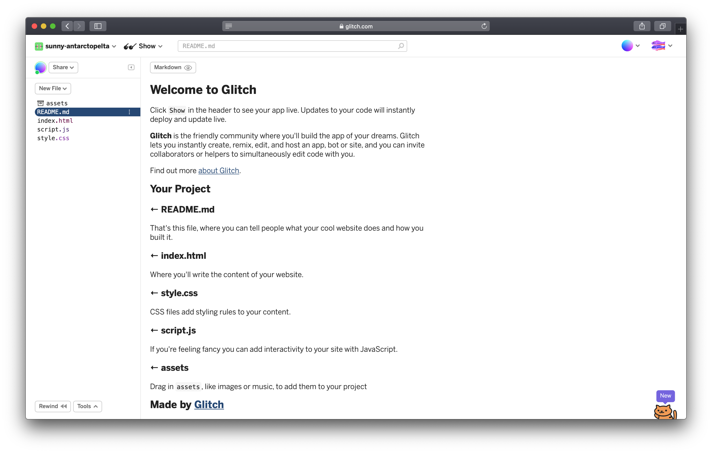
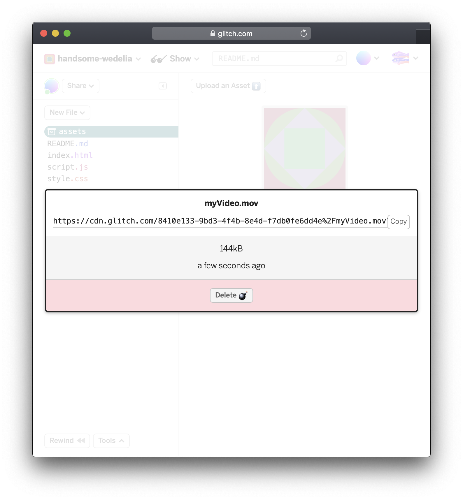

# Glitch

Glitch is a creative and expressive platform that everyone can use to create the web. In short it's a full web development package that allows for writing cool code, collaboration, easy sharing \(everything is live\), HTTPS and custom domain names.


An alternative to Glitch is [Repl.it](https://repl.it/) which offer a similar type of environment but with some key differences: uploaded files are relative to root and retain its filename, project domains exist under user account so conflicts are avoided and the console log is visible from the get go.


## Getting started

Visit [Glitch](https://glitch.com/) and create a new account or login through [Github](https://github.com). Choose **New Project** and _hello-webpage_.



Once done you will see an editor similar to this. On the left menu you see some files, and on the right the contents of the _README.md_ file — let's see what it says!



A few quick ones… You can change the domain name in the top left by clicking the current title. By clicking **Show** you can choose to view the public version of the site as a new window, or inline with your editor.

### Upload assets

While not recommended, it is possible to use Glitch as a storage for files. [Read the restrictions](https://glitch.com/help/restrictions/) for information on limit.

To upload, click **assets** and add the file\(s\). When finished, click the asset and **Copy** to get the URL. Use this wherever you need the file linked.



### Help tidy code

~~When coding it's easy to make things messy. Use the~~ [~~Prettier Glitch Bookmarklet~~](https://prettier-new.glitch.me/) ~~to help maintain sanity!~~

Glitch now uses the fabulous [Prettier](https://prettier.io/) library for this, and have the default options applied. Use a .prettierc [JSON configuration file](https://prettier.io/docs/en/configuration.html#basic-configuration) in your project if you want to set your own preferences.

### Force HTTPS

When using special features such as camera, GPS and the device API you will need visitors to use HTTPS and not HTTP. You can either explicitly  add "https://" when sharing the link or include a script that will immediately redirect the visitor.

```markup
<script>
  if (location.protocol != "https:") {
    location.href =
      "https:" +
      window.location.href.substring(window.location.protocol.length);
  }
</script>
<!-- <script src="https://gist.githubusercontent.com/jonasjohansson/1e580e1635c02683a980ee48a2b43169/raw/52c555c6b559888dd31d630d7f181118b39055ac/glitch-https.js"></script> -->
```

### Upload folders

It's not possible to drag and drop a folder, but there is a fairly painless way! 

1. Create a zip of the intended folder
2. Drag and drop it into the Glitch project and copy the link
3. Click **Tools** and **Full Page Console** to enter a terminal like window
4. Enter the following lines \(replacing the url with the copied link\)

`wget -O file.zip https:///url-to-your-zip  
unzip file.zip -d .  
rm file.zip  
refresh`


Certain files are automatically uploaded in the folder tree while others become assets with a generated URL. Upload your file with an accepted extension, such as HTML or JS and then change it once uploaded for it to remain.


## Domain

At some point the Glitch domain will not suffice. At this point it would be natural to look for a new domain! To connect a custom domain to Glitch you must be **thanked twice**, then follow [this guide](https://glitch.com/help/custom-domain/). 

