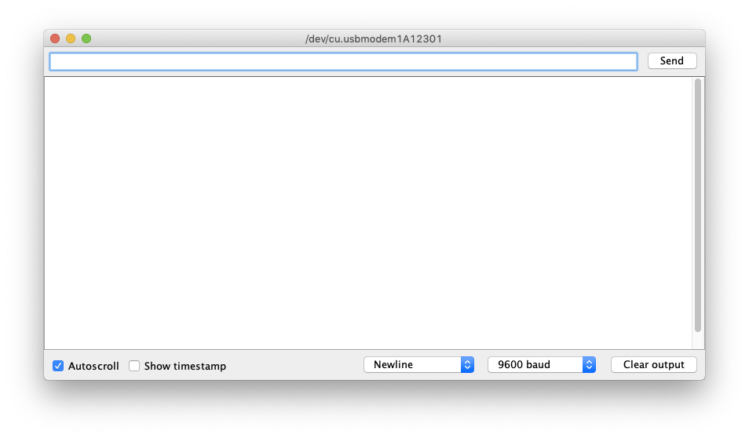

# Mio

Mio turns serial communication into a trigger for key presses and MIDI.



All logic is handled on the device and shared through specific commands, written with a **$ dollar** sign followed by the key. MIDI commands are sent by default with the control value being the index of the key referencing the key lookup table, found in Preferences.



```csharp
void setup() {
  Serial.begin(9600);
  pinMode(2, INPUT_PULLUP);
  pinMode(3, INPUT_PULLUP);
  pinMode(4, INPUT_PULLUP);
  pinMode(5, INPUT_PULLUP);
}

void loop() {
  int btn1 = digitalRead(2);
  int btn2 = digitalRead(3);
  int btn3 = digitalRead(4);
  int btn4 = digitalRead(5);

  if (btn1 == LOW) {
    Serial.println("$w");
  }

  if (btn2 == LOW) {
    Serial.println("$s");
  }

  if (btn3 == LOW) {
    Serial.println("$a");
  }

  if (btn4 == LOW) {
    Serial.println("$d");
  }
}
```



| Button Pin  | Arduino Pin |
| :--- | :--- |
| Button 1 \(orange wire\) | Digital 0 |
| Button 2 \(green wire\) | Digital 1 |
| Button 3 \(blue wire\) | Digital 2 |
| Button 4 \(purple wire\) | Digital 3 |





## Websockets

From version 1.1.1 Mio creates a local websocket server with the default port **8080** \(can be changed under Preferences\). This allows other systems \(pretty much any website\) that uses sockets, such as [p5](../software/p5/), to pick up and act on the information. This means that generative graphics, for instance, can be manipulated by a button or potentiomete. 

Messages should be made up of a string of alphabetical letters followed by the numerical value eg. `dist327`



```csharp
void setup() {
  Serial.begin(9600);
}

void loop() {
  int color = random(255);
  Serial.println("color" + String(color));
}
```



```javascript
const ws = new WebSocket('ws://127.0.0.1:8080');

let bg = 220;

function setup() {
  createCanvas(400, 400);
}

function draw() {
  background(bg);
  if (keyIsDown(LEFT_ARROW)) {
    ws.send('$left');
  } else if (keyIsDown(RIGHT_ARROW)) {
    ws.send('$right');
  }
}

ws.onmessage = data => {
  let dataObject = JSON.parse(data.data);
  print(dataObject);
  if (dataObject.id === 'color') {
    bg = dataObject.msg;
  }
};
```




It is possible to connect to the local websocket server from machines outside of the network using [ngrok](https://ngrok.com/docs). Forward the correct port and on the receiving end use the newly generated address.


## Troubleshooting

### Unidentified Developer

Because Mio is made by an [Unidentified Developer](https://jonasjohansson.se/) the Control key must be pressed while clicking the app icon. Then choose **Open** from the menu.

### Permission

In order to control the keyboard, Mio requires permissions. On Mac, go to System preferences &gt; Security & Privacy, unlock the page by clicking the lock and providing the password, and then under Accessibility find Mio and tick the box. **If a new version has been installed, this might have to be done again by toggling the checkbox!**


### Resource Busy

Mio can not be connected at the same time that any other device is listening to the serial communication, such as **Arduino's Monitor or Plotter**. The same is true for the other way around.

### Faster communication

It is possible to speed up the communication between the serial device and computer, by bumping up the **Baudrate** from **9600** to **115200**. This must be done within the code as well as in Mio. If you are running Arduino, remember to change it also in the monitor \(in the bottom right corner\).



