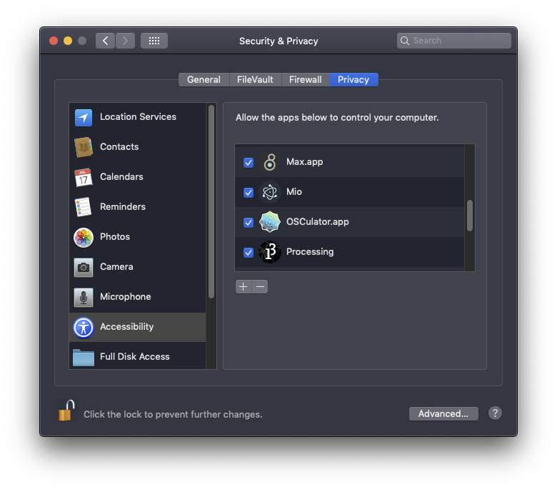

# Mio

Mio \([download](https://jonasjohansson.itch.io/mio)\) is a minimal input and output application that enables serial communication for computer interaction.

## Getting started

 All logic is handled on the sending device and made possible by printing specific messages.



```csharp
void setup() {
  Serial.begin(9600);
  pinMode(2, INPUT_PULLUP);
  pinMode(3, INPUT_PULLUP);
  pinMode(4, INPUT_PULLUP);
  pinMode(5, INPUT_PULLUP);
}

void loop() {
  int btn1 = digitalRead(2);
  int btn2 = digitalRead(3);
  int btn3 = digitalRead(4);
  int btn4 = digitalRead(5);

  if (btn1 == LOW) {
    // click 'w' key
    Serial.println("$w");
  }

  if (btn2 == LOW) {
    // click left mouse button
    Serial.println("$mouse");
  }

  if (btn3 == LOW) {
    // move cursor to x 100 and y 200
    Serial.println("100,200");
  }

  if (btn4 == LOW) {
    int red = random(255);
    // send 'red' and a random value between 0-255 over sockets
    Serial.println("red" + String(red));
  }
}
```



| Button Pin  | Arduino Pin |
| :--- | :--- |
| Button 1 \(orange wire\) | Digital 0 |
| Button 2 \(green wire\) | Digital 1 |
| Button 3 \(blue wire\) | Digital 2 |
| Button 4 \(purple wire\) | Digital 3 |





The types of messages currently supported are the following:

| Message | Event |  | Version |
| :--- | :--- | :--- | :--- |
| $w | Click **w** key | [List of keys](https://robotjs.io/docs/syntax#keys) | **1.0.0** |
| $mouse | Click **left** mouse button |  | **1.1.3** |
| 100,200 | Move cursor to **x 100** and **y 200** | Can be any number, must be comma separated. | **1.1.3** |
| /composition/master0.1 | Send **0.1** on address **/composition/master** | Can be any float | **1.1.4** |
| red255 | Send **red** and the value **255** over sockets | Can be any name and number. | **1.1.1** |

### MIDI

MIDI commands are sent with the control value being the index of the key in lookup table \(found in File &gt; Preferences\). 

### OSC

OSC commands are sent by default on port **7001**.

### Websockets

Mio creates a local websocket server with the default port **8080**. This means that generative graphics, for instance, can be manipulated by a button or potentiometer. Clients must be initialised **after** the server has started.


It's a bit secret but it is also possible to send key commands to Mio via websockets. Try typing `ws.send("$x")` and it will behave just like printing it from Arduino. Magic! 🧝🏽




```javascript
const ws = new WebSocket("ws://127.0.0.1:8080");

let red = 0;

function setup() {
  createCanvas(400, 400);
}

function draw() {
  background(red, 0, 0);
}

ws.onmessage = data => {
  let d = JSON.parse(data.data);
  print(d);
  if (d.id === "red") {
    red = d.msg;
  }
};
```



```markup
<html>
  <body>
    <script>
      const ws = new WebSocket("ws://127.0.0.1:8080");
      ws.onmessage = data => {
        let d = JSON.parse(data.data);
        console.log(d);
        if (d.id === "red") {
          document.documentElement.style.backgroundColor = `rgb(${d.msg},0,0)`;
        }
      };
    </script>
  </body>
</html>
```



It is possible to connect to the local websocket server from machines outside of the network using [ngrok](https://ngrok.com/docs). Forward the correct port and on the receiving end use the newly generated address. Another alternative is setting up a [server](https://glitch.com/~mio-server) and [client](https://glitch.com/~mio-client) on Glitch.

## Troubleshooting

### Unidentified Developer

Because Mio is made by an [Unidentified Developer](https://jonasjohansson.se/) the Control key must be pressed while clicking the app icon. Then choose **Open** from the menu.

### Permission

In order to control the keyboard, Mio requires permissions. On Mac, go to System preferences &gt; Security & Privacy, unlock the page by clicking the lock and providing the password, and then under Accessibility find Mio and tick the box. **If a new version has been installed, this might have to be done again by toggling the checkbox!**



### Resource Busy

Mio can not be connected at the same time that any other device is listening to the serial communication, such as **Arduino's Monitor or Plotter**. The same is true for the other way around.

### Faster communication

It is possible to speed up the communication between the serial device and computer, by bumping up the **Baudrate** from **9600** to **115200**. This must be done within the code as well as in Mio. If you are running Arduino, remember to change it also in the monitor \(in the bottom right corner\).


### No Communication

It is possible that Mio caches files which are then still remnant when using a new version. To clear the cache go to Help &gt; Reset and then Help &gt; Reload. If it still does not work, [contact the developer](https://jonasjohansson.se/) and send a screenshot of the window that appears when clicking Help &gt; Open Developer Tools Detached.


## Roadmap

1. Adding a modifier key along with a keypress eg. $2+alt
2. Adding possibility to send MIDI values specifically, with a ramp eg. \#16%50 \(with %50 being the amount of smoothing\)

